#  Redis原理篇

# 1、原理篇-Redis六 种数据结构和五种数据类型

> 笔记原件来自黑马B站视频配套笔记，经过自己加工修改添加等

## 1.1 Redis数据结构-动态字符串SDS

我们都知道Redis中保存的Key是字符串，value往往是字符串或者字符串的集合。可见字符串是Redis中最常用的一种数据结构。

不过Redis没有直接使用C语言中的字符串，因为C语言字符串存在很多问题：

- 获取字符串长度的需要通过运算
- 非二进制安全(不能存在特殊字符，例如C语言的字符串结尾字符'\0')
- 不可修改

Redis构建了一种新的字符串结构，称为**简单动态字符串**（Simple Dynamic String），**简称SDS**。
例如，我们执行命令：


那么Redis将在底层创建两个SDS，其中一个是包含“name”的SDS，另一个是包含“虎哥”的SDS。

Redis是C语言实现的，其中SDS是一个结构体，SDS声明了很多**对应长度**的结构体

例如SDS 8位长度的结构体 sdshdr8 源码如下：

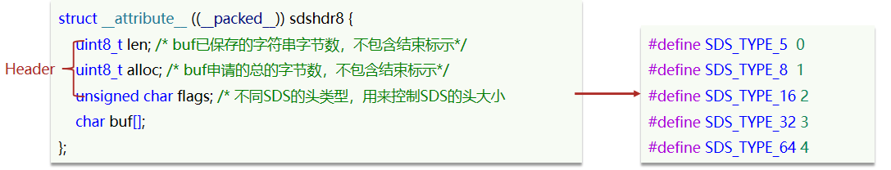

> sdshdr8代表该字符串的长度len最多由8位二进制位表示，也就是最长是**2^8^-1 = 255**
> 但是为了兼容C语言，最后也要包含一个'\0'，所以最长是**254**个字符，但是Redis读取时不会跟C语言一样将它作为结束标识来读，而是读取长度len个，是二进制安全的
>
> 然后还有sdshdr16、sdshdr32、sdshdr64 等类型的SDS结构体，其最大长度各不相同
> 还有sdshdr5，但是因为太小，已经弃用
>
> 上图右边的数字代表结构体中不同sds对应的flag的值

例如，一个包含字符串“name”的sds结构如下：


SDS之所以叫做**动态字符串，是因为它具备动态扩容的能力**，例如一个内容为“hi”的SDS：

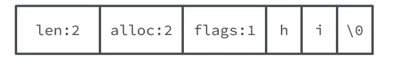

假如我们要给SDS追加一段字符串“,Amy”，这里首先会申请新内存空间：

- 如果新字符串**小于1M**，则新空间为**扩展后字符串长度的两倍+1**；

- 如果新字符串**大于1M**，则新空间为**扩展后字符串长度+1M+1**；

这种多扩展一些新空间的方式称为**内存预分配**。

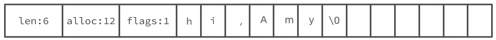

> alloc = (2+4)*2 = 12	因为alloc不包含结束标识，但是后面的格子是12+1=13个
>
> **内存预分配：**重新分配内存很消耗资源，预分配后若下次还需扩容，若空间足够就不用再分配了，减少内存分配次数


## 1.2 Redis数据结构-整数集合intset

IntSet是Redis中**set集合的一种实现方式**，基于整数数组来实现，并且具备**长度可变**、**有序**等特征。
结构如下：


这里的contents整数数组的类型 int8_t 不是只能存储 -128~127 的整数，而是**由其encoding决定**的；
其中的encoding包含三种模式，表示存储的整数大小不同：


为了方便查找，Redis会将intset中所有的整数**按照升序**依次保存在contents数组中，结构如图：


现在，数组中每个数字都在int16_t的范围内，因此采用的编码方式是**INTSET_ENC_INT16**，每部分占用的字节大小为：
encoding：4字节
length：4字节
contents：2字节 * 3  = 6字节（**每个整数的大小取决于encoding**）

> constants数组是使用指针来指向内存中的地址，地址 = startPtr + (sizeof(int16)*index)
> 所以为了性能考虑，很多数组的脚标都从0开始


**intset升级编码：**

现在，假设有一个intset,元素为{5,10,20}，采用的编码是**INTSET_ENC INT16**，则每个整数占2字节：


我们向该其中添加一个数字：50000，这个数字超出了int16_t的范围，intset会自动升级编码方式到合适的大小。
以当前案例来说流程如下：

* 升级编码为**INTSET_ENC_INT32**, 每个整数占4字节，并按照新的编码方式及元素个数扩容数组
* **倒序**依次将数组中的元素拷贝到扩容后的正确位置
* 将待添加的元素放入数组末尾
* 最后，将inset的encoding属性改为INTSET_ENC_INT32，将length属性改为4


升级源码如下：

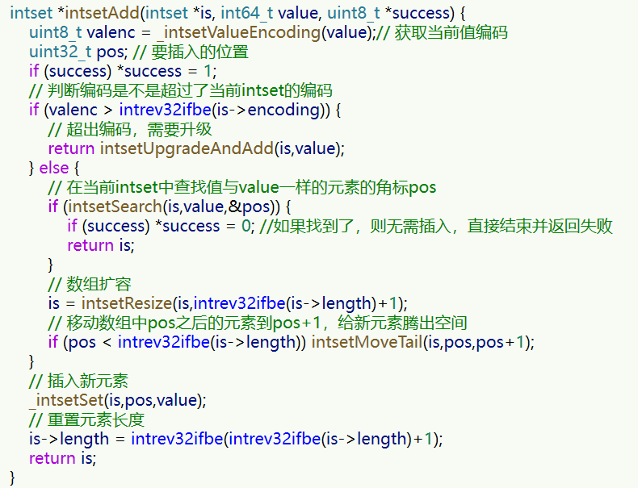

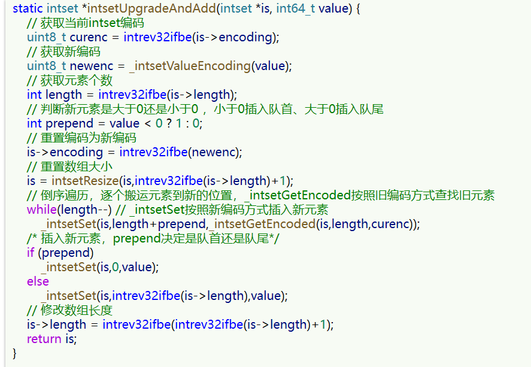


小总结：

Intset可以看做是特殊的整数数组，具备一些特点：

* Redis会确保Intset中的元素唯一、有序
* 具备类型升级机制，可以节省内存空间
* 底层采用二分查找方式来查询


## 1.3 Redis数据结构-哈希表Dict

我们知道Redis是一个键值型（Key-Value Pair）的数据库，我们可以根据键实现快速的增删改查。而键与值的映射关系正是通过Dict来实现的。

Dict由三部分组成，分别是：**哈希表**（DictHashTable）、**哈希节点**（DictEntry）、**字典**（Dict）


> entry的个数used是可以大于哈希表的大小size的，因为跟Java中一样，哈希冲突时，会使用一个链表来存储hash值相同的元素

当我们向Dict添加键值对时，Redis首先根据key计算出hash值（h），然后利用 **h & sizemask**来计算元素应该存储到数组中的哪个索引位置。我们存储k1=v1，假设k1的哈希值h =1，则1&3 =1，因此k1=v1要存储到数组角标1位置。

> 为什么使用 h & sizemask 与运算，而不使用求余运算？
>
> 哈希表的大小**size初始大小为4**，且必须是**2^n^**，所以sizemask = size - 1
> 在这种情况下，**h & sizemask = h % size**，并且位运算的速度通常比取模操作**更快**


Dict由三部分组成，分别是：哈希表（DictHashTable）、哈希节点（DictEntry）、字典（Dict）

> 字典 > 哈希表 > 哈希节点


**Dict的扩容**

Dict中的HashTable就是数组结合单向链表的实现，当集合中元素较多时，必然导致哈希冲突增多，链表过长，则查询效率会大大降低。
Dict在每次新增键值对时都会检查**负载因子**（LoadFactor = **used/size**） ，满足以下两种情况时会触发哈希表扩容：

1. 哈希表的 **LoadFactor >= 1**，并**且**服务器**没有执行 BGSAVE 或者 BGREWRITEAOF** 等后台进程；
2. 哈希表的 **LoadFactor > 5** ；


**Dict的收缩** 

Dict除了扩容以外，每次删除元素时，也会对负载因子做检查，当**LoadFactor<0.1**时，会做哈希表收缩：


**Dict的rehash**

不管是扩容还是收缩，必定会调用**dictExpand**（与下面rehash步骤中前3步相同）方法，其中会创建新的哈希表，导致哈希表的size和sizemask变化，而key的查询与sizemask有关。因此必须对哈希表中的**每一个key重新计算索引**，插入新的哈希表，这个过程称为**rehash**。过程是这样的：

1. 计算新hash表的realeSize，值取决于当前要做的是扩容还是收缩：

     * 如果是扩容，则新size为**第一个大于等于dict.ht[0].used + 1的2^n^**

     * 如果是收缩，则新size为**第一个大于等于dict.ht[0].used的2^n^ （不得小于4）**

2. 按照新的realeSize申请内存空间，创建dictht，并赋值给dict.ht[1]
3. 设置dict.rehashidx = **0**，标示开始rehash
4. ~~将dict.ht[0]中的每一个dictEntry都rehash到dict.ht[1]~~（非渐进式哈希）
   每次执行新增、查询、修改、删除**操作时**，都**检查一下dict.rehashidx是否大于-1**，如果**是则将dict.ht[0].table[rehashidx]的entry链表rehash到dict.ht[1]，并且将rehashidx++**。直至dict.ht[0]的所有数据都rehash到dict.ht[1]。（**每次只rehash一个**entry到ht[1]）
5. 将dict.ht[1]赋值给dict.ht[0]，给dict.ht[1]初始化为空哈希表，释放原来的dict.ht[0]的内存
6. 将rehashidx赋值为**-1**，代表rehash结束
7. 在rehash过程中，**新增操作，则直接写入ht[1]**，查询、修改和删除则会在dict.ht[0]和dict.ht[1]依次查找并执行。这样可以确保ht[0]的数据只减不增，随着rehash最终为空

> （非渐进式哈希）整个过程的动画描述可以参考 《Redis原理篇.pptx》 的27~28页，进行动态ppt演示
> 资源链接：https://github.com/spongehah/redis/blob/main/04-%E5%8E%9F%E7%90%86%E7%AF%87/%E8%AE%B2%E4%B9%89/Redis%E5%8E%9F%E7%90%86%E7%AF%87.pptx
>
> 
>
> Dict的**rehash并不是一次性完成的**。试想一下，如果Dict中包含数百万的entry,要在一次rehash完成，极有可能导致主线程阻塞。因此Dict的rehash:是分多次、渐进式的完成，因此称为**渐进式rehash**。流程如上列第4 6 7步
>
> 注：第三步只会在还未开始rehash时才会设置为0代表开始rehash，因为用过源码我们可以看到，当正在rehash时我们是不会扩容与缩容的

小总结：

Dict的结构：

* 类似java的HashTable，底层是数组加链表来解决哈希冲突
* Dict包含两个哈希表，ht[0]平常用，ht[1]用来rehash

Dict的伸缩：

* 当LoadFactor大于5或者LoadFactor大于1并且没有子进程任务时，Dict扩容
* 当LoadFactor小于0.1时，Dict收缩
* 扩容大小为第一个大于等于used + 1的2^n^
* 收缩大小为第一个大于等于used 的2^n^（不得小于4）
* Dict采用渐进式rehash，每次访问Dict时执行一次rehash
* rehash时ht[0]只减不增，新增操作只在ht[1]执行，其它操作在两个哈希表

Dict的缺点：

- Dict内部大量使用指针，内存空间不连续，通过指针链接，且容易产生内存碎片，造成严重的内存浪费
- 指针也会占据存储空间，大量指针占据很多内存


## 1.4 Redis数据结构-压缩列表ZipList

为节省内存，改善Dict哈希表的问题，出现了ZipList

ZipList 是一种**特殊的“双端链表”** ，由一系列特殊编码的**连续内存块**组成。可以在任意一端进行压入/弹出操作, 并且该操作的时间复杂度为 O(1)。

> **不是双端链表，但有双端链表的特点，且内存块是连续的，不需要通过指针寻址**


| **属性** | **类型** | **长度** | **用途**                                                     |
| -------- | -------- | -------- | ------------------------------------------------------------ |
| zlbytes  | uint32_t | 4 字节   | 记录整个压缩列表占用的内存字节数                             |
| zltail   | uint32_t | 4 字节   | 记录压缩列表表尾节点距离压缩列表的起始地址有多少字节，通过这个偏移量，可以确定表尾节点的地址。 |
| zllen    | uint16_t | 2 字节   | 记录了压缩列表包含的节点数量。 最大值为UINT16_MAX （65534），如果超过这个值，此处会记录为65535，但节点的真实数量需要遍历整个压缩列表才能计算得出。 |
| entry    | 列表节点 | 不定     | 压缩列表包含的各个节点，**节点的长度由节点保存的内容决定**。 |
| zlend    | uint8_t  | 1 字节   | 特殊值 0xFF （十进制 255 ），用于标记压缩列表的末端。        |


**ZipListEntry**

ZipList 中的Entry并不像普通链表那样记录前后节点的指针，因为记录两个指针要占用16个字节，浪费内存。而是采用了下面的结构：


* previous_entry_length：前一节点的长度，占**1**个或**5**个字节。
  * 如果前一节点的长度**小于254字节**，则采用**1**个字节来保存这个长度值
  * 如果前一节点的长度**大于254字节**，则采用**5**个字节来保存这个长度值，**第一个字节为0xfe**，后四个字节才是真实长度数据
* encoding：编码属性，记录content的数据类型（字符串还是整数）以及长度，占用**1**个、**2**个或**5**个字节
* contents：负责保存节点的数据，可以是字符串或整数

> 所以entry三个部分的长度都可以知晓，顺序遍历时只需要加上entry的长度，倒序遍历时只需要减去pre_len

ZipList中所有**存储长度**的数值均采用**小端字节序**，即低位字节在前，高位字节在后。例如：数值0x1234，采用小端字节序后实际存储值为：0x3412

**Encoding编码**

ZipListEntry中的encoding编码分为字符串和整数两种：
**①字符串：**如果encoding是以**“00”**、**“01”**或者**“10”**开头，则证明content是字符串

| **编码**                                             | **编码长度** | **字符串大小**             |
| ---------------------------------------------------- | ------------ | -------------------------- |
| \|00pppppp\|                                         | 1 bytes      | <= 63 bytes(2^6^)          |
| \|01pppppp\|qqqqqqqq\|                               | 2 bytes      | <= 16383 bytes(2^14^)      |
| \|10000000\|qqqqqqqq\|rrrrrrrr\|ssssssss\|tttttttt\| | 5 bytes      | <= 4294967295 bytes(2^32^) |

例如，我们要保存字符串：“ab”和 “bc”


> zlbytes、zltail、zllen等标表示长度的属性使用小端字节序


ZipListEntry中的encoding编码分为字符串和整数两种：
**②整数：**如果encoding是以**“11”**开始，则证明content是整数，且**encoding固定只占用1个字节**

| **编码** | **编码长度** | **整数类型**                                                 |
| -------- | ------------ | ------------------------------------------------------------ |
| 11000000 | 1            | int16_t（2 bytes）                                           |
| 11010000 | 1            | int32_t（4 bytes）                                           |
| 11100000 | 1            | int64_t（8 bytes）                                           |
| 11110000 | 1            | 24位有符整数(3 bytes)                                        |
| 11111110 | 1            | 8位有符整数(1 bytes)                                         |
| 1111xxxx | 1            | 直接在xxxx位置保存数值，范围从0001 ~ 1101(十进制1 ~ 13)，减1后结果为实际值（0 ~ 12） |

例如：一个ZipList中包含两个整数值： “2” 和 “5”


### 1.5 Redis数据结构-ZipList的连锁更新问题

ZipList的每个Entry都包含previous_entry_length来记录上一个节点的大小，长度是1个或5个字节：
如果前一节点的长度小于254字节，则采用1个字节来保存这个长度值
如果前一节点的长度大于等于254字节，则采用5个字节来保存这个长度值，第一个字节为0xfe，后四个字节才是真实长度数据
现在，假设我们有**N个连续的、长度为250~253字节之间的entry**（前提），因此entry的previous_entry_length属性用1个字节即可表示，可是当**突然在前面插入一个长度大于254字节的entry**，就会发生连锁更新问题，如图所示：


ZipList这种特殊情况下产生的连续多次空间扩展操作称之为**连锁更新**（Cascade Update）。新增、删除都可能导致连锁更新的发生。

> 概率很低，因为需要N个连续的、长度为250~253字节之间的entry，条件较为苛刻

**小总结：**

**ZipList特性：**

* 压缩列表的可以看做一种连续内存空间的"双向链表"
* 列表的节点之间不是通过指针连接，而是记录上一节点和本节点长度来寻址，内存占用较低
* 如果列表数据过多，导致链表过长，可能影响查询性能
* 增或删较大数据时有可能发生连续更新问题

## 1.6 Redis数据结构-快速列表QuickList

问题1：ZipList虽然节省内存，但申请内存必须是连续空间，如果内存占用较多，申请内存效率很低。怎么办？

​	答：为了缓解这个问题，我们必须限制ZipList的长度和entry大小。

问题2：但是我们要存储大量数据，超出了ZipList最佳的上限该怎么办？

​	答：我们可以创建多个ZipList来分片存储数据。

问题3：数据拆分后比较分散，不方便管理和查找，这多个ZipList如何建立联系？

​	答：Redis在3.2版本引入了新的数据结构**QuickList**，它是一个双端链表，只不过链表中的**每个节点都是一个ZipList**。


为了避免QuickList中的每个ZipList中entry过多，Redis提供了一个配置项：**list-max-ziplist-size**来限制。

如果值为**正**，则代表ZipList的允许的entry个数的最大值
如果值为**负**，则代表ZipList的最大内存大小，分5种情况：

* -1：每个ZipList的内存占用不能超过4kb
* -2：每个ZipList的内存占用不能超过8kb
* -3：每个ZipList的内存占用不能超过16kb
* -4：每个ZipList的内存占用不能超过32kb
* -5：每个ZipList的内存占用不能超过64kb

> 这里的单位是 KB 更为合理，使用kb很容易让人产生误解，但是Redis配置文件中声明了1kb = 1024bytes
>
> ```
> # Note on units: when memory size is needed, it is possible to specify
> # it in the usual form of 1k 5GB 4M and so forth:
> #
> # 1k => 1000 bytes
> # 1kb => 1024 bytes
> # 1m => 1000000 bytes
> # 1mb => 1024*1024 bytes
> # 1g => 1000000000 bytes
> # 1gb => 1024*1024*1024 bytes
> #
> # units are case insensitive so 1GB 1Gb 1gB are all the same.
> ```

其**默认值为 -2：**


除了控制ZipList的大小，QuickList还可以对节点的ZipListf做压缩。通过配置项**list-compress-depth**来控制。因为链表一般都是从首尾访问较多，中间节点的访问次数较少，所以首尾是不压缩的。这个参数是**控制首尾不压缩的节点个数**：

- 0:特殊值，代表不压缩
- 1:标示QuickList的首尾各有1个节点不压缩，中间节点压缩
- 2:标示QuickList的首尾各有2个节点不压缩，中间节点压缩
- 以此类推

其**默认值为：0：**


以下是QuickList的和QuickListNode的结构源码：


我们接下来用一段流程图来描述当前的这个结构


总结：

QuickList的特点：

* 是一个节点为ZipList的双端链表
* 节点采用ZipList，**解决了传统链表的内存占用问题**
* 控制了ZipList大小，**解决连续内存空间申请效率问题**（兼具链表和ZipList的优点）
* 中间节点可以压缩，进一步节省了内存


## 1.7 Redis数据结构-跳表SkipList

**SkipList（跳表）**首先是**链表**，但与传统链表相比有几点**差异**：

- 元素按照**升序**排列存储
- 节点可能包含多个指针，指针跨度不同。


SkipList（跳表）首先是链表，但与传统链表相比有几点差异：

- 元素按照**升序**排列存储
- 节点可能包含多个指针，指针跨度不同，最高跨度可高达32层，由底层函数进行具体推算适合多少层跨度的指针。


SkipList（跳表）首先是链表，但与传统链表相比有几点差异：

- 元素按照**升序**排列存储
- 节点可能包含多个指针，指针跨度不同。


跳表的**时间复杂度**是log~2~N：

如果链表里有N个结点，会有多少级索引呢？

按照我们前面讲的，两两取首。每两个结点会抽出一个结点作为上一级索引的结点，以此估算：

- 第一级索引的结点个数大约就是n/2，
- 第二级索引的结点个数大约就是n/4，
- 第三级索引的结点个数大约就是n/8，依次类推......

也就是说，第k级索引的结点个数是第k-1级索引的结点个数的1/2，那第k级索引结点的个数就是n/(2^k^)
最高级索引有2个，所以 n/(2^k^) = 2  -->  k = log~2~n - 1	，算上原始链表，就是**log~2~n**


跳表的**空间复杂度**是O(N)：

比起单纯的单链表，跳表需要存储多级索引，肯定要消耗更多的存储空间。那到底需要消耗多少额外的存储空间呢？

我们来分析一下跳表的空间复杂度。

- 第一步：首先原始链表长度为n，
- 第二步：**两两取首**，每层索引的结点数：**n/2, n/4, n/8 ... , 8, 4, 2** 每上升一级就减少一半，直到剩下2个结点,以此类推；如果我们把每层索引的结点数写出来，就是一个等比数列。

这几级索引的结点总和就是**n/2+n/4+n/8…+8+4+2=n-2**。所以，跳表的空间复杂度是**O(n)** 。也就是说，如果将包含n个结点的单链表构造成跳表，我们需要额外再用接近n个结点的存储空间。

- 第三步：思考**三三取首**，每层索引的结点数：**n/3, n/9, n/27 ... , 9, 3, 1** 以此类推；

第一级索引需要大约n/3个结点，第二级索引需要大约n/9个结点。每往上一级，索引结点个数都除以3。为了方便计算，我们假设最高一级的索引结点个数是1。我们把每级索引的结点个数都写下来，也是一个等比数列
**n/3+n/9+n/27+...+9+3+1=n/2**。尽管空间复杂度还是**O(n)** ，但比上面的每两个结点抽一个结点的索引构建方法，要减少了一半的索引结点存储空间。**所以空间复杂度是O(n)；**


跳表的**优缺点**：

- 优点：跳表是一个最典型的**空间换时间解决方案**，而且只有在**数据量较大**的情况下才能体现出来优势。而且应该是**读多写少的情况下**才能使用，所以它的适用范围应该还是比较有限的
- 缺点：维护成本相对要高，
  在**单链表**中，一旦定位好要插入的位置，插入结点的时间复杂度是很低的，就是O(1)
  在**跳表**中，新增或者删除时需要**把所有索引都更新一遍**，为了保证原始链表中数据的有序性，我们需要先找到要动的位置，这个查找操作就会比较耗时最后在新增和删除的过程中的更新，**时间复杂度也是O(log~2~N)**


小总结：

SkipList的特点：

* 跳跃表是一个双向链表，每个节点都包含score和ele值
* 节点按照score值排序，score值一样则按照ele字典排序
* 每个节点都可以包含多层指针，层数是1到32之间的随机数
* 不同层指针到下一个节点的跨度不同，层级越高，跨度越大
* 增删改查效率与红黑树基本一致，实现却更简单


## 1.8 Redis数据结构-RedisObject

**Redis中的任意数据类型的键和值都会被封装为一个RedisObject，也叫做Redis对象**，源码如下：

1、什么是redisObject：
从Redis的使用者的角度来看，⼀个Redis节点包含多个database（非cluster模式下默认是16个，cluster模式下只能是1个），而一个database维护了从key space到object space的映射关系。这个映射关系的key是string类型，⽽value可以是多种数据类型，比如：
string, list, hash、set、sorted set等。我们可以看到，key的类型固定是string，而value可能的类型是多个。
⽽从Redis内部实现的⾓度来看，database内的这个映射关系是用⼀个dict来维护的。dict的key固定用⼀种数据结构来表达就够了，这就是动态字符串sds。而value则比较复杂，为了在同⼀个dict内能够存储不同类型的value，这就需要⼀个通⽤的数据结构，这个通用的数据结构就是robj，全名是redisObject。


> 所以每个Redis对象头就要占据16个字节(0.5+0.5+3+4+8)，所以**推荐使用集合的类型来存储数据**
> 比如：存储10个字符串需要10个对象头，也就浪费160个字节，若使用list来存储，只需要1个对象头


**Redis的编码方式：**

Redis中会根据存储的数据类型不同，选择不同的编码方式，共包含11种不同类型：

| **编号** | **编码方式**            | **说明**                  |
| -------- | ----------------------- | ------------------------- |
| 0        | OBJ_ENCODING_RAW        | raw编码动态字符串         |
| 1        | OBJ_ENCODING_INT        | long类型的整数的字符串    |
| 2        | OBJ_ENCODING_HT         | hash表（字典dict）        |
| 3        | OBJ_ENCODING_ZIPMAP     | 已废弃                    |
| 4        | OBJ_ENCODING_LINKEDLIST | 双端链表（早期Redis使用） |
| 5        | OBJ_ENCODING_ZIPLIST    | 压缩列表                  |
| 6        | OBJ_ENCODING_INTSET     | 整数集合                  |
| 7        | OBJ_ENCODING_SKIPLIST   | 跳表                      |
| 8        | OBJ_ENCODING_EMBSTR     | embstr的动态字符串        |
| 9        | OBJ_ENCODING_QUICKLIST  | 快速列表                  |
| 10       | OBJ_ENCODING_STREAM     | Stream流                  |


**五种数据类型对应的编码：**

Redis中会根据存储的数据类型不同，选择不同的编码方式。每种数据类型的使用的编码方式如下：

| **数据类型** | **编码方式**                                        |
| ------------ | --------------------------------------------------- |
| OBJ_STRING   | int、embstr、raw                                    |
| OBJ_LIST     | LinkedList和ZipList（3.2以前)、QuickList（3.2以后） |
| OBJ_SET      | intset、HT                                          |
| OBJ_ZSET     | ZipList、HT和SkipList                               |
| OBJ_HASH     | ZipList、HT                                         |


## 1.9 Redis数据类型-String

String是Redis中最常见的数据存储类型：

底层实现⽅式：动态字符串sds 或者 long
String的内部存储结构⼀般是sds（Simple Dynamic String，可以动态扩展内存），但是**如果⼀个String类型的value的值是数字，那么Redis内部会把它转成long类型来存储，从⽽减少内存的使用。**

- 其基本编码方式是**RAW**，基于简单动态字符串（SDS）实现，**存储上限为512MB**。
  

- 如果存储的SDS长度**小于44字节**，则会采用**EMBSTR**编码，此时object head与SDS是一段**连续空间**。申请内存时只需要调用一次内存分配函数，效率更高。
  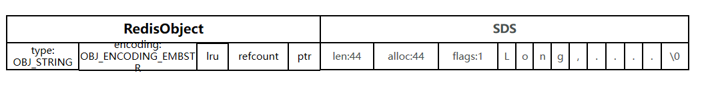
  

  > 由图：若SDS长度为44字节，那么RedisObject(对象头16字节)+SDS(采用sdshdr8：1+1+1+44+1)的大小刚好为64字节，Redis底层分配内存的算法是**jemalloc**，会以2^n^做内存分配，而64字节刚好是2^6^，分配内存时不会产生内存碎片

- 如果存储的字符串是**整数值**，并且大小在**LONG_MAX范围内**，则会采用**INT**编码：直接将**数据保存在RedisObject的ptr指针位置（刚好8字节），不再需要SDS了。**
  


**总结：**


> 可使用 object encoding key 查看key的字符编码，详情请看《Redis最佳实践》

确切地说，String在Redis中是⽤⼀个robj来表示的。

用来表示String的robj可能编码成3种内部表⽰：
OBJ_ENCODING_RAW，OBJ_ENCODING_EMBSTR，OBJ_ENCODING_INT。
其中前两种编码使⽤的是sds来存储，最后⼀种OBJ_ENCODING_INT编码直接把string存成了long型。
在对string进行incr, decr等操作的时候，如果它内部是OBJ_ENCODING_INT编码，那么可以直接行加减操作；如果它内部是OBJ_ENCODING_RAW或OBJ_ENCODING_EMBSTR编码，那么Redis会先试图把sds存储的字符串转成long型，如果能转成功，再进行加减操作。对⼀个内部表示成long型的string执行append, setbit, getrange这些命令，针对的仍然是string的值（即⼗进制表示的字符串），而不是针对内部表⽰的long型进⾏操作。比如字串”32”，如果按照字符数组来解释，它包含两个字符，它们的ASCII码分别是0x33和0x32。当我们执行命令setbit key 7 0的时候，相当于把字符0x33变成了0x32，这样字符串的值就变成了”22”。⽽如果将字符串”32”按照内部的64位long型来解释，那么它是0x0000000000000020，在这个基础上执⾏setbit位操作，结果就完全不对了。因此，在这些命令的实现中，会把long型先转成字符串再进行相应的操作。


## 2.0 Redis数据类型-List

Redis的List类型可以从首、尾操作列表中的元素：


哪一个数据结构能满足上述特征？

* LinkedList ：普通链表，可以从双端访问，内存占用较高，内存碎片较多
* ZipList ：压缩列表，可以从双端访问，内存占用低，存储上限低
* **QuickList**：LinkedList + ZipList，可以从双端访问，内存占用较低，包含多个ZipList，存储上限高（同时具备二者的优点）

Redis的List结构类似一个双端链表，可以从首、尾操作列表中的元素：

**在3.2版本之前**，Redis采用ZipList和LinkedList来实现List，当元素数量小于512并且元素大小小于64字节时采用ZipList编码，超过则采用LinkedList编码。

**在3.2版本之后**，Redis统一采用QuickList来实现List：


## 2.1 Redis数据类型-Set结构

Set是Redis中的单列集合，满足下列特点：

* **不保证有序性**
* 保证元素**唯一**
* 求交集、并集、差集


可以看出，Set对查询元素的效率要求非常高，思考一下，什么样的数据结构可以满足？
HashTable，也就是Redis中的Dict，不过Dict是双列集合（可以存键、值对）

Set是Redis中的集合，不一定确保元素有序，可以满足元素唯一、查询效率要求极高。

- 为了查询效率和唯一性，set采用**HT**编码（Dict）。Dict中的key用来存储元素，value统一为null。
- 当存储的**所有数据都是整数**，并且元素数量不超过**set-max-intset-entries(默认值为512)**时，Set会采用**IntSet**编码，以节省内存


每次插入都会检查是否满足 都是整数 和 数量不超过**set-max-intset-entries** 这两个条件，如果不满足，则会将IntSet编码转换为HT编码：


结构如下：


## 2.2 Redis数据类型-ZSET

ZSet也就是SortedSet，其中每一个元素都需要指定一个score值和member值：

* 可以根据score值排序后
* member必须唯一
* 可以根据member查询分数


因此，zset底层数据结构必须满足**键值存储**、**键必须唯一**、**可排序**这几个需求。之前学习的哪种编码结构可以满足？

* SkipList：可以排序，并且可以同时存储score和ele值（member），但是无法根据key查询val
* HT（Dict）：可以键值存储，并且可以根据key找value，但是无法排序

所以ZSet选择**全都要**，在RedisObject和数据结构中间加了一层结构体 struct zset，如图：


> o->encoding只写了SKIPLIST，但是其实是两种


此时使用SkipList和Dict的唯一缺点：**内存占用太高**

当元素数量不多时，HT和SkipList的优势不明显，而且更耗内存。因此zset还会采用**ZipList**结构来节省内存，不过需要**同时满足两个条件：**

1. 元素数量小于**zset_max_ziplist_entries**，**默认值128**
2. 每个元素都小于**zset_max_ziplist_value**字节，**默认值64**

ziplist本身没有排序功能，而且没有键值对的概念，因此需要有zset通过编码实现：

* ZipList是连续内存，因此score和element是紧挨在一起的两个entry， **element在前，score在后**
* score**越小越接近队首**，score越大越接近队尾，按照score值升序排列
  


**ZSet创建和新元素插入过程：**


既然拥有ZSet和ZipList两种类型的编码，那么也会和Set一样出现编码转换的问题：


> 可以看到：ZipList转化为HT和SkipList的条件除了上列的两个外，还有一个方法：**ziplistSafeToAdd()**，内容是若ZipList的总大小超过1G，也会转化为HT和SkipList（ZSet和Hash都这样）
> 但是正常情况下，128*64 < 1G


## 2.3 Redis数据类型-Hash

hash结构如下：


zset集合如下：

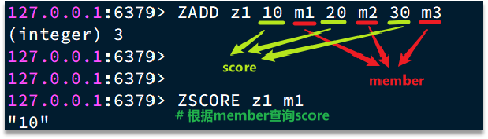

Hash结构与Redis中的Zset非常类似：

* 都是键值存储
* 都需求根据键获取值
* 键必须唯一

区别如下：

* zset的键是member，值是score；hash的键和值都是任意值
* zset要根据score排序；hash则无需排序


因此，Hash底层采用的编码与Zset也基本一致，只需要把排序有关的SkipList去掉即可：

- Hash结构**默认采用ZipList**编码，用以节省内存。 ZipList中相邻的两个entry 分别保存field和value
- 当数据量较大时，Hash结构会转为HT编码，也就是Dict，触发条件有两个：
  - ①ZipList中的元素数量超过了**hash-max-ziplist-entries**（默认512）
  - ②ZipList中的任意entry大小超过了**hash-max-ziplist-value**（默认64字节）

当满足上面两个条件其中之⼀的时候，Redis就使⽤dict字典来实现hash。


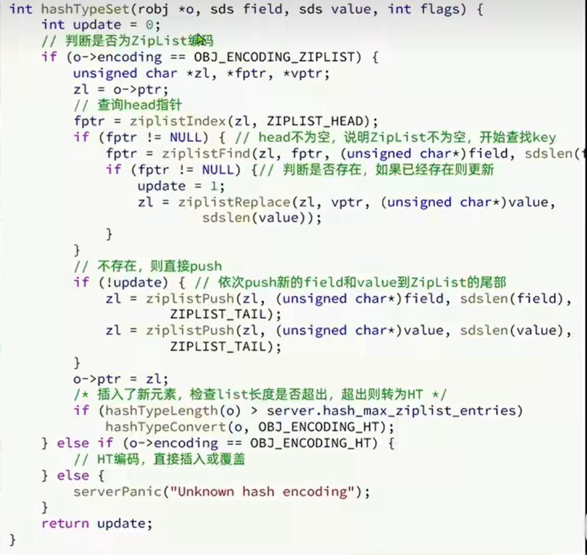

> 可以看到：ZipList转化为HT的条件除了上列的两个外，还有一个方法：**ziplistSafeToAdd()**，内容是若ZipList的总大小超过1G，也会转化为HT（ZSet和Hash都这样）


Redis的hash之所以这样设计，是因为当**ziplist变得很⼤的时候**，它有如下几个**缺点**：

* 每次插⼊或修改引发的realloc操作会有更⼤的概率造成内存拷贝，从而降低性能。
* ⼀旦发生内存拷贝，内存拷贝的成本也相应增加，因为要拷贝更⼤的⼀块数据。
* 当ziplist数据项过多的时候，在它上⾯查找指定的数据项就会性能变得很低，因为ziplist上的查找需要进行遍历。

总之，ziplist本来就设计为各个数据项挨在⼀起组成连续的**内存空间**，这种结构并不擅长做修改操作。**⼀旦数据发⽣改动，就会引发内存realloc**，可能导致内存拷贝。


# 2、原理篇-Redis网络模型

## 2.1 用户空间和内核态空间

服务器大多都采用Linux系统，这里我们以Linux为例来讲解:

ubuntu和Centos 都是Linux的发行版，发行版可以看成对linux包了一层壳，任何Linux发行版，其系统内核都是Linux。我们的应用都需要通过Linux内核与硬件交互


用户的应用，比如redis，mysql等其实是没有办法去执行访问我们操作系统的硬件的，所以我们可以通过发行版的这个壳子去访问内核，再通过内核去访问计算机硬件


计算机硬件包括，如cpu，内存，网卡等等，内核（通过寻址空间）可以操作硬件的，但是内核需要不同设备的驱动，有了这些驱动之后，内核就可以去对计算机硬件去进行 内存管理，文件系统的管理，进程的管理等等

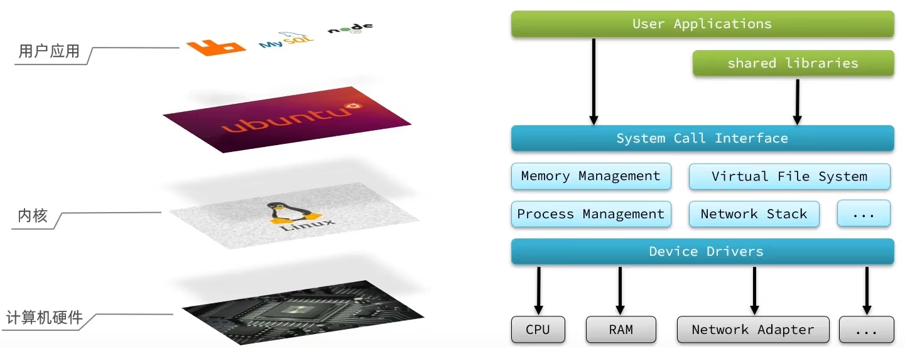


我们想要用户的应用来访问，计算机就必须要通过对外暴露的一些接口，才能访问到，从而简介的实现对内核的操控，但是内核本身上来说也是一个应用，所以他本身也需要一些内存，cpu等设备资源，用户应用本身也在消耗这些资源，如果不加任何限制，用户去操作随意的去操作我们的资源，就有可能导致一些冲突，甚至有可能导致我们的系统出现无法运行的问题，因此我们需要把用户和**内核隔离开**

进程的寻址空间划分成两部分：**内核空间、用户空间**

什么是寻址空间呢？我们的应用程序也好，还是内核空间也好，都是没有办法直接去物理内存的，而是通过分配一些虚拟内存映射到物理内存中，我们的内核和应用程序去访问虚拟内存的时候，就需要一个虚拟地址，这个地址是一个无符号的整数，比如一个32位的操作系统，他的带宽就是32，他的虚拟地址就是2的32次方，也就是说他寻址的范围就是0~2的32次方， 这片寻址空间对应的就是2的32个字节，就是4GB，这个4GB，会有3个GB分给用户空间，会有1GB给内核系统


在linux中，他们权限分成两个等级，0和3，用户空间只能执行受限的命令（Ring3），而且不能直接调用系统资源，必须通过内核提供的接口来访问内核空间可以执行特权命令（Ring0），调用一切系统资源，所以一般情况下，用户的操作是运行在用户空间，而内核运行的数据是在内核空间的，而有的情况下，一个应用程序需要去调用一些特权资源，去调用一些内核空间的操作，所以此时他俩需要在用户态和内核态之间进行切换。

比如：

Linux系统为了提高IO效率，会在用户空间和内核空间都加入缓冲区：

- 写数据时，要把用户缓冲数据拷贝到内核缓冲区，然后写入设备

- 读数据时，要从设备读取数据到内核缓冲区，然后拷贝到用户缓冲区


针对这个操作：我们的用户在写读数据时，会去向内核态申请，想要读取内核的数据，而内核数据要去等待驱动程序从硬件上读取数据，当从磁盘上加载到数据之后，内核会将数据写入到内核的缓冲区中，然后再将数据拷贝到用户态的buffer中，然后再返回给应用程序，整体而言，速度慢，就是这个原因，为了加速，我们希望read也好，还是wait for data也最好都**不要等待，或者时间尽量的短。**


## 2.2.网络模型1-阻塞IO

在《UNIX网络编程》一书中，总结归纳了5种IO模型：

* 阻塞IO（Blocking IO）**BIO**
* 非阻塞IO（Nonblocking IO）**NIO**
* IO多路复用（IO Multiplexing）
* 信号驱动IO（Signal Driven IO）
* 异步IO（Asynchronous IO）**AIO**

应用程序想要去读取数据，他是无法直接去读取磁盘数据的，他需要先到内核里边去等待内核操作硬件拿到数据，**这个过程就是1**，是需要等待的，**等到内核从磁盘上把数据加载出来之后**，再把这个数据**写给用户的缓存区**，**这个过程是2**，如果是阻塞IO，那么整个过程中，**用户从发起读请求开始，一直到读取到数据，都是一个阻塞状态。**


具体流程如下图：


用户去读取数据时，会去先发起**recvform**一个命令，去尝试从内核上加载数据，**如果内核没有数据，那么用户就会等待**，此时内核会去从硬件上读取数据，内核读取数据之后，会把数据拷贝到用户态，并且返回ok，整个过程，都是阻塞等待的，这就是阻塞IO


总结如下：

顾名思义，**阻塞IO就是两个阶段都必须阻塞等待：**

阶段一：

- 用户进程尝试读取数据（比如网卡数据）
- 此时数据尚未到达，内核需要等待数据
- 此时用户进程也处于**阻塞**状态

阶段二：

* 数据到达并拷贝到内核缓冲区，代表已就绪
* 将内核数据拷贝到用户缓冲区
* 拷贝过程中，用户进程依然**阻塞**等待
* 拷贝完成，用户进程解除阻塞，处理数据

可以看到，阻塞IO模型中，**用户进程在两个阶段都是阻塞状态**。


## 2.3 网络模型2-非阻塞IO

顾名思义，非阻塞IO的recvfrom操作会立即返回结果而不是阻塞用户进程。

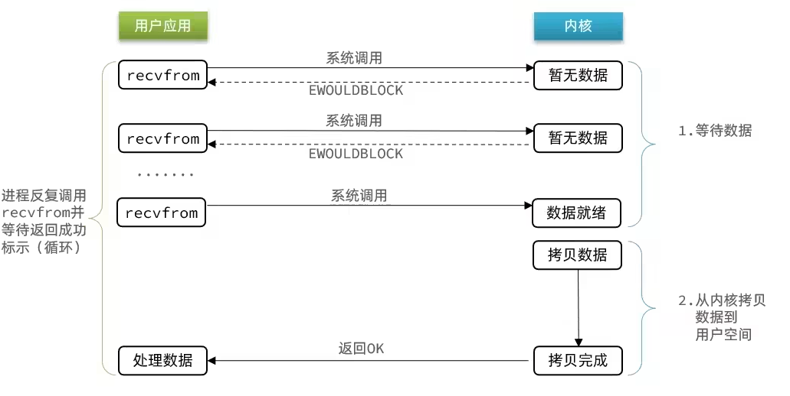

阶段一：

* 用户进程尝试读取数据（比如网卡数据）
* 此时数据尚未到达，内核需要等待数据
* **返回异常给用户进程**
* 用户进程拿到error后，再次尝试读取
* 循环往复，直到数据就绪

阶段二：

* 将内核数据拷贝到用户缓冲区
* **拷贝过程中，用户进程依然阻塞等待**
* 拷贝完成，用户进程解除阻塞，处理数据

可以看到，非阻塞IO模型中，**用户进程在第一个阶段是非阻塞，第二个阶段是阻塞状态**。虽然是非阻塞，但**性能并没有得到提高**。而且忙等机制会导致CPU空转，**CPU使用率暴增**。


## 2.4 网络模型3-IO多路复用

无论是阻塞IO还是非阻塞IO，用户应用在一阶段都需要调用recvfrom来获取数据，差别在于无数据时的处理方案：

- 如果调用recvfrom时，恰好**没有数据**，阻塞IO会使CPU阻塞，非阻塞IO使CPU空转，都不能充分发挥CPU的作用。
- 如果调用recvfrom时，恰好**有数据**，则用户进程可以直接进入第二阶段，读取并处理数据

所以怎么看起来以上两种方式性能都不好

而在**单线程情况下，只能依次处理IO事件**，如果正在处理的IO事件恰好未就绪（数据不可读或不可写），线程就会被阻塞，所有IO事件都必须等待，性能自然会很差。

就比如服务员给顾客点餐，**分两步**：

* 顾客思考要吃什么（等待数据就绪）
* 顾客想好了，开始点餐（读取数据）


要提高效率有几种**办法**？

- 方案一：增加更多服务员（**多线程**）
- 方案二：不排队，**谁想好了吃什么（数据就绪了），服务员就给谁点餐**（用户应用就去读取数据）

那么问题来了：**用户进程如何知道内核中数据是否就绪呢？**

所以接下来就需要详细的来解决多路复用模型是如何知道到底怎么知道内核数据是否就绪的问题了

这个问题的解决依赖于提出的

**文件描述符**（File Descriptor）：简称**FD**，**是一个从 0 开始的无符号整数，用来关联Linux中的一个文件**。在**Linux中，一切皆文件**，例如常规文件、视频、硬件设备等，当然也包括网络套接字（Socket）。

**IO多路复用**：是利用**单个线程来同时监听多个FD**，并在某个FD可读、可写时得到通知，从而避免无效的等待，充分利用CPU资源。

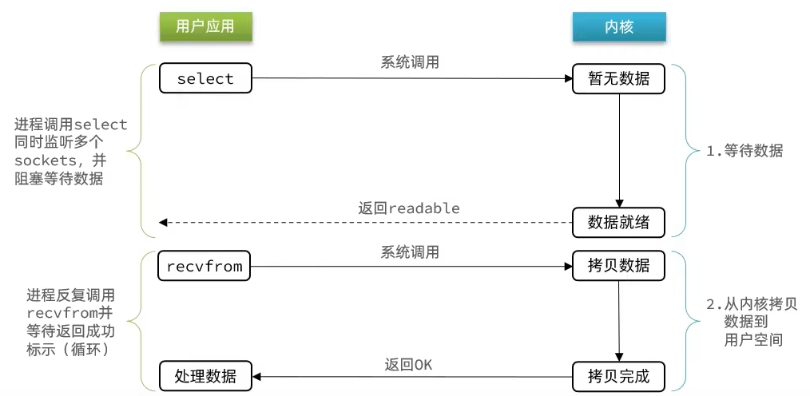

阶段一：

* 用户进程**调用select，** **指定**要监听的**FD集合**
* 内核监听FD对应的多个socket
* 任意一个或多个socket数据就绪则返回readable
* 此过程中用户进程阻塞

阶段二：

* 用户进程找到就绪的socket
* 依次调用recvfrom读取数据
* 内核将数据拷贝到用户空间
* 用户进程处理数据

当用户去读取数据的时候，**不再去直接调用recvfrom了，而是调用select的函数，select函数会将需要监听的数据交给内核，由内核去检查这些数据是否就绪了**，如果说这个数据就绪了，就会通知应用程序数据就绪，然后来读取数据，再从内核中把数据拷贝给用户态，完成数据处理，如果N多个FD一个都没处理完，此时就进行等待。

用IO复用模式，可以**确保去读数据(recvfrom)的时候，数据是一定存在的**，他的效率比原来的阻塞IO和非阻塞IO性能都要高


IO多路复用是利用单个线程来同时监听多个FD，并在某个FD可读、可写时得到通知，从而**避免无效的等待**，充分利用CPU资源。不过监听FD的方式、通知的方式又有多种实现，常见的有：

- select
- poll
- epoll

select和poll**只会通知用户进程有FD就绪**，但不确定具体是哪个FD，需要用户进程**逐个遍历FD来确认**

epoll则会在通知用户进程FD就绪的同时，**把已就绪的FD写入用户空间**


### 2.5 网络模型-IO多路复用-select方式

select是Linux最早是由的I/O多路复用技术：

简单说，就是我们把需要处理的数据封装成FD，然后在用户态时创建一个fd的集合（这个集合的大小是要监听的那个FD的最大值+1，但是大小整体是有限制的 ），这个集合的长度大小是有限制的，同时在这个集合中，标明出来我们要控制哪些数据，


> nfds：fd_set中**最大fd+1**，在此例中是6，遍历时遍历到nfds时就可以不再遍历
>
> _fd_mask fds_bits[ _FD_SETSIZE / _NFDBISTS]：存储要监听的fd的数组，是一个长度为32的long int数组，但是存储一个fd只需要一个bit，而long int是4个字节，所以可以存储32 * (4 * 8) = **1024个fd**

比如要监听的数据，是**1,2,5**三个数据，二进制位为 **00010011** ，步骤如下：

1. 此时用户进程会执行select函数，然后**将整个fd拷贝给内核态**，内核态会去**遍历**用户态传递过来的数据，如果发现这里边都数据都**没有就绪，就休眠**，
2. 直到有数据准备好时，就会被唤醒，**唤醒之后，再次遍历一遍**，看看谁准备好了，然后再将**处理掉没有准备好的数据（设为0）**，
3. 最后再将这个**FD集合写回到用户态**中去，覆盖之前的用户fd集合
4. 因为用户进程并**不知道哪个是准备好的fd**，因此还需要再**遍历一遍fd集合**，找到对应准备好数据的节点，再去发起读请求


**select模式存在的问题：**

- 需要将整个fd_set从用户空间拷贝到内核空间，select结束还要再次拷贝回用户空间
- select无法得知具体是哪个fd就绪，需要遍历整个fd_set
- fd_set监听的fd数量不能超过1024


### 2.6 网络模型-IO多路复用模型-poll模式

poll模式对select模式做了简单改进，但性能提升不明显，部分关键代码如下：

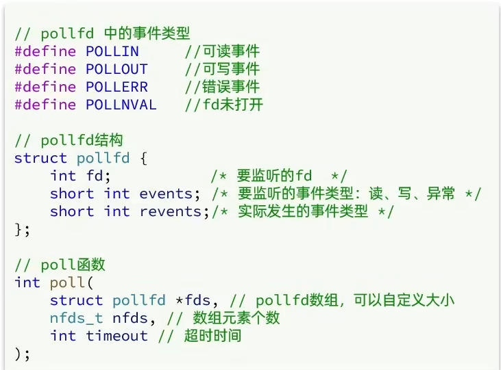

IO流程：

1. **创建pollfd数组**，向其中添加关注的fd信息，数组**大小自定义**
2. 调用poll函数，**将pollfd数组拷贝到内核空间**，转链表存储，无上限
3. 内核遍历fd，判断是否就绪
4. 数据就绪或超时后，**拷贝pollfd数组到用户空间，返回就绪fd数量n**
5. 用户进程判断n是否大于0,大于0则遍历pollfd数组，找到就绪的fd


**与select对比：**

* select模式中的fd_set大小固定为1024，而pollfd在内核中采用**链表，理论上无上限**
* 虽然pollfd没有上限，但是**监听FD越多，每次遍历消耗时间也越久，性能反而会下降**
* 仍然是要拷贝两次


### 2.7 网络模型-IO多路复用模型-epoll函数

epoll模式是对select和poll的改进，它提供了三个函数：


第一个是：创建eventpoll的函数epoll_create，eventpoll内部包含两个东西：

- 1、**红黑树** -> 记录的事要**监听的FD**
- 2、**链表** -> 一个链表，记录的是**就绪的FD**

第二个是：epoll_ctl操作：将**一个**要监听的数据添加到红黑树上去，并且给每个fd设置一个**监听函数**，这个函数会在fd数据就绪时触发，**当fd准备好了，就把fd添加到list_head中去**

第三个是：调用epoll_wait函数：就去等待，**在用户态创建一个空的events数组**，当就绪之后，我们的回调函数会把就绪的fd添加到list_head中去，当调用这个函数的时候，会去**检查list_head**，当然这个过程需要参考配置的等待时间，可以等一定时间，也可以一直等，如果在此过程中，检查到了list_head中有数据会将数据添加到链表中，此时将数据**放入到events数组**中，并且**返回对应的操作的数量**，用户态的此时收到响应后，从events中拿到对应准备好的数据的节点，再去调用方法去拿数据。


小总结：

select模式存在的三个问题：

* 能监听的FD最大不超过1024
* 每次select都需要把所有要监听的FD都拷贝到内核空间
* 每次都要遍历所有FD来判断就绪状态

poll模式的问题：（只解决了select的第一个问题）

* poll利用链表解决了select中监听FD上限的问题，但依然要遍历所有FD，如果监听较多，性能会下降

**epoll模式中如何解决这些问题的？**

* 基于epoll实例中的**红黑树**保存要监听的FD，理论上无上限，而且**增删改查效率都非常高**，性能不会随监听的FD数量增多而下降
* **每个FD只需要执行一次epoll_ctl添加到红黑树**，以后每次epol_wait无需传递任何参数，无需重复拷贝FD到内核空间
* 利用ep_poll_callback机制来监听FD状态，内核**只将就绪的FD拷贝到用户空间的指定位置，无需遍历所有FD**


#### 2.8 网络模型-epoll中的事件通知机制-LT和ET

当FD有数据可读时，我们调用epoll_wait（或者select、poll）可以得到通知。但是事件通知的模式有两种：

* LevelTriggered：简称**LT**，也叫做**水平触发**。当FD有数据可读时，**会重复通知多次**，直至数据处理完成。是Epol的**默认模式**。
  只要某个FD中有数据可读，**每次调用epoll_wait都会得到通知**。
* EdgeTriggered：简称**ET**，也叫做**边沿触发**。当FD有数据可读时，**只会被通知一次**，不管数据是否处理完成。
  只有在某个FD有**状态变化**时，**调用epoll_wait才会被通知**。

举个栗子：

1. 假设一个客户端socket对应的FD已经注册到了epoll实例中
2. 客户端socket发送了2kb的数据
3. 服务端调用epoll_wait，得到通知说FD就绪
4. 服务端从FD读取了1kb数据
5. LT模式会回到步骤3（再次调用epoll_wait，形成循环），而ET模式不会


如果我们采用LT模式，因为FD中仍有1kb数据，则第⑤步依然会返回结果，并且得到通知
如果我们采用ET模式，因为第③步已经消费了FD可读事件，第⑤步FD状态没有变化，因此epoll_wait不会返回，数据无法读取，客户端响应超时。

> 每当调用epoll_wait读取走数据后，系统会判断当前是LT模式还是ET模式：
> 若是LT模式，则不会断开list_head中与就绪数据的链接，下次读取时仍然能够发现有就绪数据
> 若是ET模式，则会断开list_head中与就绪数据的链接，下次读取时将没有数据可读

结论：

1. ET模式避免了LT模式可能出现的**惊群现象**
2. ET模式最好**结合非阻塞IO读取FD数据**（利用代码实现，在一次读取数据时将所有数据消费完，或者手动调用epoll_ctl函数，重新连接list_head和就绪数据），相比LT会复杂一些


#### 2.9 网络模型-基于epoll的Web服务流程

我们来梳理一下这张图

服务器启动以后，服务端会去调用epoll_create，创建一个epoll实例，epoll实例中包含两个数据

1、红黑树（为空）：rb_root 用来去记录需要被监听的FD

2、链表（为空）：list_head，用来存放已经就绪的FD

创建好了之后，会去调用epoll_ctl函数，此函数会会将需要监听的数据添加到rb_root中去，并且对当前这些存在于红黑树的节点设置回调函数，当这些被监听的数据一旦准备完成，就会被调用，而调用的结果就是将红黑树的fd添加到list_head中去(但是此时并没有完成)

3、当第二步完成后，就会调用epoll_wait函数，这个函数会去校验是否有数据准备完毕（因为数据一旦准备就绪，就会被回调函数添加到list_head中），在等待了一段时间后(可以进行配置)，如果等够了超时时间，则返回没有数据，**如果有，则进一步判断当前是什么事件**，如果是**建立连接事件，则调用accept()** 接受客户端socket，拿到建立连接的socket，然后建立起来连接，**如果是其他事件，则把数据进行写出**


这里的ssfd是否可读有两种条件，1，可读就是有客户端连接来了（ssfd可读），2，非可读就是web已有的客户端请求接口进行数据访问，包括接收客户端请求数据（客户端读事件）和回复响应数据（客户端写事件）
Redis具体服务流程请看 3.4 Redis的单线程模型...


## 3.0 网络模型4-信号驱动

信号驱动IO是与内核建立SIGIO的信号关联并设置回调，当内核有FD就绪时，会发出SIGIO信号通知用户，期间用户应用可以执行其它业务，无需阻塞等待。

阶段一：

* 用户进程调用sigaction，注册信号处理函数
* 内核返回成功，开始监听FD
* 用户进程不阻塞等待，可以执行其它业务
* 当内核数据就绪后，回调用户进程的SIGIO处理函数

阶段二：

* 收到SIGIO回调信号
* 调用recvfrom，读取
* 内核将数据拷贝到用户空间
* 用户进程处理数据


**为什么没有IO多路复用用的多？**（缺点）

当有**大量IO操作时，信号较多**，SIGIO处理函数不能及时处理可能导致**信号队列溢出，**

而且内核空间与用户空间的**频繁信号交互**性能也较低。


## 3.1 网络模型5-异步IO

这种方式，不仅仅是用户态在试图读取数据后，不阻塞，而且当内核的数据准备完成后，也不会阻塞

他会由内核将所有数据处理完成后，由内核将数据写入到用户态中，然后才算完成，所以**性能极高**，**不会有任何阻塞**，全部都由内核完成，可以看到，异步IO模型中，**用户进程在两个阶段都是非阻塞状态。**


缺点：
性能“太高”，因为IO读写效率较低，用户进程不阻塞的话，高并发场景下就会一直给内核下达任务，最终可能导致OOM
所以，**若要使用异步IO，必须做好限流策略**


## 3.2 五种IO模型的对比

IO操作是同步还是异步，关键看数据在内核空间与用户空间的拷贝过程（数据读写的IO操作），也就是阶段二是同步还是异步：

前四种都是同步IO，只有异步IO是异步的


**使用最多的是IO多路复用**，少数情况下会用到异步IO但要做好限流


## 3.3 网络模型-Redis是单线程的吗？为什么使用单线程

**Redis到底是单线程还是多线程？**

* 如果仅仅聊Redis的**核心业务部分（命令处理）**，答案是**单线程**
* 如果是聊**整个Redis**，那么答案就是**多线程**

在Redis版本迭代过程中，在两个重要的时间节点上引入了多线程的支持：

* Redis v4.0：引入多线程**异步处理一些耗时较长的任务**，例如异步删除命令unlink
* Redis v6.0：在**核心网络模型中引入多线程**，进一步提高对于多核CPU的利用率

因此，对于Redis的核心网络模型，在Redis 6.0之前确实都是单线程。是利用epoll（Linux系统）这样的IO多路复用技术在事件循环中不断处理客户端情况。

**为什么Redis要选择单线程？**

* 抛开持久化不谈，**Redis是纯内存操作**，执行速度非常快，它的性能**瓶颈是网络带宽IO速度而不是执行速度**，因此多线程并不会带来巨大的性能提升。
* 多线程会导致过多的上下文切换，带来不必要的开销
* 引入多线程会面临线程安全问题，必然要引入线程锁这样的安全手段，实现复杂度增高，而且性能也会大打折扣


## 3.4 Redis的单线程模型-Redis单线程和多线程网络模型变更

Redis通过IO多路复用来提高网络性能，并且支持各种不同的多路复用实现，并且将这些实现进行封装， 提供了统一的高性能事件库API库 AE：

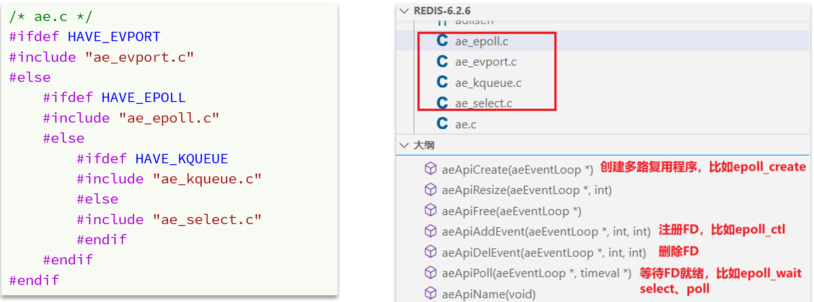

看源码时结合下面的的流程图：


> 1. 调用aeCreateEventLoop方法(**类似epoll_create**)，创建实例
> 2. 调用listenToPort方法，创建serverSocket得到ssfd
> 3. 调用createSocketAcceptHandler方法注册监听ssfd，对ssfd绑定**连接应答处理器tcpAcceptHandler**(**类似服务端的epoll_ctl**)
>    - **tcpAcceptHandler**的触发条件是**有新的客户端连接进来**了，作用是接收客户端socket数据得到其中的fd，然后创建连接关联客户端fd，监听客户端fd，并对客户端fd绑定**读命令请求处理器readQueryFromClient**
> 4. 注册**aeApiPoll前置处理器beforeSleep**，调用aeApiPoll前调用
>    - 调用aeApiPoll前监听server.clients_pending_write队列，即监听队列中是否有第一次处理好请求的client，若有则对client绑定**写命令回复处理器sendReplyToClient**，可以把该client准备好的数据响应写到客户端。(一个client代表一次连接，但是一个连接可以有很多请求，即很多fd)
> 5. 注册监听好ssfd并绑定好客户端读/写命令处理器后，**先调用beforeSleep**，再调用aeApiPoll方法(类似epoll_wait)，开始循环监听事件，看是否有fd准备就绪（这里的fd包括服务端的ssfd和客户端fd：）
>    - 服务端ssfd的作用是当有客户端请求进来时**调用连接应答处理器tcpAcceptHandler**对客户端socket进行连接，注册监听其中的fd并绑定readQueryFromClient(**类似客户端的epoll_ctl**)(对应ssfd可读)
>    - 客户端fd有两种（对应ssfd不可读），一种是**读事件**，发生在客户端fd刚注册绑定好过后(**即IO多路复用模型中第一阶段的系统调用**)，会**调用读命令请求处理器readQueryFromClient**：先通过客户端连接对象conn得到客户端对象client，将客户端连接conn中的请求数据写入该客户端对象client的querybuffer，然后解析querybuffer中的数据转换为Redis命令存入argv数组中，然后客户端拿出argv数组中的命令选择执行Redis命令后得到执行结果，先将结果写入该客户端对象client的buf(客户端写缓冲区)中，如果写不下就写入客户端对象client的reply链表中(容量无上限)，将客户端添加到server.clients_pending_write这个队列，等待被写出(自此，**IO多路复用模型中第一阶段的等待数据完成**)
>    - 另一种是**写事件**，在第4步时因为每次调用aeApiPoll前都会调用beforeSleep，而beforeSleep会遍历server.clients_pending_write队列检查是否有准备好数据的client，并会对该队列中的每个client都绑定上了写命令回复处理器，当该client有数据准备好时即**调用绑定的写命令回复处理器sendReplyToClient**，把准备好的响应数据写到客户端socket发送给客户端(**即IO多路复用模型中第二阶段返回数据给用户进程的过程**)

> 参考一下大佬写的流程(引自 [Redis 多线程网络模型全面揭秘](https://segmentfault.com/a/1190000039223696))：
>
> 1. Redis 服务器启动，开启主线程事件循环（Event Loop），注册 `acceptTcpHandler` 连接应答处理器到用户配置的监听端口对应的文件描述符，等待新连接到来；
> 2. 客户端和服务端建立网络连接；
> 3. `acceptTcpHandler` 被调用，主线程使用 AE 的 API 将 `readQueryFromClient` 命令读取处理器绑定到新连接对应的文件描述符上，并初始化一个 `client` 绑定这个客户端连接；
> 4. 客户端发送请求命令，触发读就绪事件，主线程调用 `readQueryFromClient` 通过 socket 读取客户端发送过来的命令存入 `client->querybuf` 读入缓冲区；
> 5. 接着调用 `processInputBuffer`，在其中使用 `processInlineBuffer` 或者 `processMultibulkBuffer` 根据 Redis 协议解析命令，最后调用 `processCommand` 执行命令；
> 6. 根据请求命令的类型（SET, GET, DEL, EXEC 等），分配相应的命令执行器去执行，最后调用 `addReply` 函数族的一系列函数将响应数据写入到对应 `client` 的写出缓冲区：`client->buf` 或者 `client->reply` ，`client->buf` 是首选的写出缓冲区，固定大小 16KB，一般来说可以缓冲足够多的响应数据，但是如果客户端在时间窗口内需要响应的数据非常大，那么则会自动切换到 `client->reply` 链表上去，使用链表理论上能够保存无限大的数据（受限于机器的物理内存），最后把 `client` 添加进一个 LIFO 队列 `clients_pending_write`；
> 7. 在事件循环（Event Loop）中，主线程执行 `beforeSleep` --> `handleClientsWithPendingWrites`，遍历 `clients_pending_write` 队列，调用 `writeToClient` 把 `client` 的写出缓冲区里的数据回写到客户端，如果写出缓冲区还有数据遗留，则注册 `sendReplyToClient` 命令回复处理器到该连接的写就绪事件，等待客户端可写时在事件循环中再继续回写残余的响应数据。

中间三个即 **IO多路复用 + 事件派发**：


当我们的客户端想要去连接我们服务器，会去**先到IO多路复用模型去进行排队**，会有一个连接应答处理器，他会去接受读请求，然后又把读请求注册到具体模型中去，此时这些建立起来的连接，如果是客户端请求处理器去进行执行命令时，他会去把数据读取出来，然后把数据放入到client中， clinet去解析当前的命令转化为redis认识的命令，接下来就开始处理这些命令，从redis中的command中找到这些命令，然后就真正的去操作对应的数据了，当数据操作完成后，会去找到命令回复处理器，再由他将数据写出。


**Redis6.0引入多线程网络模型：**

Rdis6.0版本中引入了多线程，目的是为了提高引IO读写效率。因此在**解析客户端命令、写响应结果**时采用了多线程。核心的命令执行、 IO多路复用模块依然是由主线程执行。


> Redis的瓶颈是带宽IO操作，所以**多线程只用于网络模型中的IO操作**：
>
> 如图：只在接收客户端命令时有IO操作，在回复响应数据时有IO操作，在这两个地方使用多线程，能够加快IO速度，提升Redis服务吞吐量


# 3、Redis通信协议-RESP协议

Redis是一个CS架构的软件，通信一般分两步（不包括pipeline和PubSub）：

1. 客户端（client）向服务端（server）发送一条命令

2. 服务端解析并执行命令，返回响应结果给客户端


因此**客户端发送命令的格式**、**服务端响应结果的格式**必须有一个**规范**，这个规范就是**通信协议**。


而在Redis中采用的是**RESP**（Redis Serialization Protocol）协议：

- Redis 1.2版本引入了RESP协议

- Redis 2.0版本中成为与Redis服务端通信的标准，称为RESP2

- Redis 6.0版本中，从RESP2升级到了RESP3协议，增加了更多数据类型并且支持6.0的新特性--客户端缓存


但在**Redis6.0**中，**默认使用的依然是RESP2**协议，也是我们要学习的协议版本（以下简称RESP）。


## 3.1 Resp协议-五种数据类型

在RESP中，通过首字节的字符来区分不同数据类型，常用的数据类型包括5种：

1. **单行字符串**：首字节是 ‘**+**’ ，后面跟上单行字符串，以CRLF（ "**\r\n**" ）结尾。例如返回"OK"： "+OK\r\n"
2. **错误**（Errors）：首字节是 ‘**-**’ ，与单行字符串格式一样，只是字符串是异常信息，例如："-Error message\r\n"
3. **数值**：首字节是 ‘**:**’ ，后面跟上数字格式的字符串，以CRLF结尾。例如：":10\r\n"
4. **多行字符串**：首字节是 ‘**$**’ ，表示二进制安全的字符串，最大支持512MB：
   
   - 如果大小为0，则代表空字符串："$0\r\n\r\n"

   - 如果大小为-1，则代表不存在："$-1\r\n"

5. **数组**：首字节是 ‘*****’，后面跟上数组元素个数，再跟上元素，元素数据类型不限
   

在Redis中，发请求使用的一般是数组，而响应五种都有可能


## 3.2 Redis通信协议-基于Socket模拟Redis客户端

Redis支持TCP通信，因此我们可以使用Socket来模拟客户端，与Redis服务端建立连接：


```java
public class Main {

    static Socket s;
    static PrintWriter writer;
    static BufferedReader reader;

    public static void main(String[] args) {
        try {
            // 1.建立连接
            String host = "192.168.150.101";
            int port = 6379;
            s = new Socket(host, port);
            // 2.获取输出流、输入流
            writer = new PrintWriter(new OutputStreamWriter(s.getOutputStream(), StandardCharsets.UTF_8));
            reader = new BufferedReader(new InputStreamReader(s.getInputStream(), StandardCharsets.UTF_8));

            // 3.发出请求
            // 3.1.获取授权 auth 123321
            sendRequest("auth", "123321");
            Object obj = handleResponse();
            System.out.println("obj = " + obj);

            // 3.2.set name 虎哥
            sendRequest("set", "name", "虎哥");
            // 4.解析响应
            obj = handleResponse();
            System.out.println("obj = " + obj);

            // 3.2.set name 虎哥
            sendRequest("get", "name");
            // 4.解析响应
            obj = handleResponse();
            System.out.println("obj = " + obj);

            // 3.2.set name 虎哥
            sendRequest("mget", "name", "num", "msg");
            // 4.解析响应
            obj = handleResponse();
            System.out.println("obj = " + obj);
        } catch (IOException e) {
            e.printStackTrace();
        } finally {
            // 5.释放连接
            try {
                if (reader != null) reader.close();
                if (writer != null) writer.close();
                if (s != null) s.close();
            } catch (IOException e) {
                e.printStackTrace();
            }
        }
    }

    private static Object handleResponse() throws IOException {
        // 读取首字节
        int prefix = reader.read();
        // 判断数据类型标示
        switch (prefix) {
            case '+': // 单行字符串，直接读一行
                return reader.readLine();
            case '-': // 异常，也读一行
                throw new RuntimeException(reader.readLine());
            case ':': // 数字
                return Long.parseLong(reader.readLine());
            case '$': // 多行字符串
                // 先读长度
                int len = Integer.parseInt(reader.readLine());
                if (len == -1) {
                    return null;
                }
                if (len == 0) {
                    return "";
                }
                // 再读数据,读len个字节。我们假设没有特殊字符，所以读一行（简化）
                return reader.readLine();
            case '*':
                return readBulkString();
            default:
                throw new RuntimeException("错误的数据格式！");
        }
    }

    private static Object readBulkString() throws IOException {
        // 获取数组大小
        int len = Integer.parseInt(reader.readLine());
        if (len <= 0) {
            return null;
        }
        // 定义集合，接收多个元素
        List<Object> list = new ArrayList<>(len);
        // 遍历，依次读取每个元素
        for (int i = 0; i < len; i++) {
            list.add(handleResponse());
        }
        return list;
    }

    // set name 虎哥
    private static void sendRequest(String ... args) {
        writer.println("*" + args.length);
        for (String arg : args) {
            writer.println("$" + arg.getBytes(StandardCharsets.UTF_8).length);
            writer.println(arg);
        }
        writer.flush();
    }
}

```


# 4、Redis内存回收

Redis之所以性能强，最主要的原因就是基于内存存储。然而单节点的Redis其内存大小不宜过大，会影响持久化或主从同步性能。
我们可以通过修改配置文件来设置Redis的最大内存：


当内存使用达到上限时，就无法存储更多数据了。为了解决这个问题，Redis提供了一些策略实现内存回收：

- 内存过期策略
- 内存淘汰策略

## 4.1 Redis内存回收-过期策略

在学习Redis缓存的时候我们说过，可以通过expire命令给Redis的key设置TTL（存活时间）：


可以发现，当key的TTL到期以后，再次访问name返回的是nil，说明这个key已经不存在了，对应的内存也得到释放。从而起到内存回收的目的。

这里有两个问题需要我们思考：

- ①Redis是如何知道一个key是否过期呢？
  - 利用两个Dict分别记录key-value对及key-ttl对
- ②是不是TTL到期就立即删除了呢？
  - 惰性删除
  - 周期删除


**RedisDB的数据结构：**

Redis本身是一个典型的key-value内存存储数据库，因此所有的key、value都保存在之前学习过的Dict结构中。不过在其**database结构体中，有两个Dict：一个用来记录key-value；另一个用来记录key-TTL**。


> 现在我们可以回答第一个问题：
>
> Redis是如何知道一个key是否过期呢？
>
> **利用两个Dict分别记录key-value对及key-ttl对**


**惰性删除**

**惰性删除**：顾明思议**并不是在TTL到期后就立刻删除**，而是在访问一个key的时候，检查该key的存活时间，如果已经过期才执行删除。(**增删改查时发现过期才删除**)


**周期删除**

**周期删除**：顾明思议是通过一个定时任务，周期性的**抽样部分过期的key**，然后执行删除。执行周期有两种：

- Redis会设定一个定时任务**serverCron()**，按照server.hz的频率来执行过期key清理，模式为**SLOW**(默认)
- Redis的每个事件循环前会调用**beforeSleep()**函数，执行过期key清理，模式为**FAST**


> 在前面讲到的Redis单线程模型中，在init时会关联SLOW模式回调函数serverCron，
>
> 根据你设定的周期删除的策略：
> 如果是FAST，那么在aeMain方法调用aeApiPoll(类似epoll_wait)前会调用beforeSleep进行Fast清理，
> 如果是SLOW，那么在aeApiPoll后会调用serverCron进行SLOW清理

**SLOW**模式规则：

1. 执行频率受server.hz影响，默认为10，即每秒执行10次，每个执行周期100ms。

2. 执行清理耗时不超过一次执行周期的25%.默认slow模式耗时**不超过25ms**

3. 逐个遍历db，逐个遍历db中的bucket，抽取20个key判断是否过期

4. 如果没达到时间上限（25ms）并且过期key比例大于10%，再进行一次抽样，否则结束

   

**FAST**模式规则（过期key比例小于10%不执行 ）：

1. 执行频率受beforeSleep()调用频率影响，但两次FAST模式间隔不低于2ms
2. 执行清理耗时不超过1ms
3. 逐个遍历db，逐个遍历db中的bucket，抽取20个key判断是否过期
4. 如果没达到时间上限（1ms）并且过期key比例大于10%，再进行一次抽样，否则结束


小总结：

RedisKey的TTL记录方式：

- 在RedisDB中通过一个Dict记录每个Key的TTL时间


过期key的删除策略：

- 惰性清理：每次查找key时判断是否过期，如果过期则删除

- 定期清理：定期抽样部分key，判断是否过期，如果过期则删除。
  定期清理的两种模式：

  - SLOW模式执行频率默认为10，每次不超过25ms


  - FAST模式执行频率不固定，但两次间隔不低于2ms，每次耗时不超过1ms


## 4.2 Redis内存回收-淘汰策略

**内存淘汰**：就是当Redis内存使用达到设置的上限时，主动挑选**部分key**删除以释放更多内存的流程。Redis会在处理客户端命令的方法processCommand()中尝试做内存淘汰：


> 内存淘汰的前提条件：
>
> 1. 设置了**server.maxmemory**属性
> 2. **没有执行的lua脚本**

**淘汰策略：**

Redis支持**8种**不同策略来选择要删除的key：

* ①noeviction： 不淘汰任何key，但是内存满时不允许写入新数据，**默认**就是这种策略。


* ②volatile-ttl： 对设置了TTL的key，比较key的剩余TTL值，TTL越小越先被淘汰


* ③allkeys-random：对全体key ，随机进行淘汰。也就是直接从db->dict中随机挑选
* ④volatile-random：对设置了TTL的key ，随机进行淘汰。也就是从db->expires中随机挑选。


* ⑤allkeys-lru： 对全体key，基于LRU算法进行淘汰
* ⑥volatile-lru： 对设置了TTL的key，基于LRU算法进行淘汰


* ⑦allkeys-lfu： 对全体key，基于LFU算法进行淘汰
* ⑧volatile-lfu： 对设置了TTL的key，基于LFI算法进行淘汰


比较容易混淆的有两个：

* **LRU**（Least Recently Used），**最少最近使用**。记录的是最后一次访问时间戳，用当前时间减去最后一次访问时间，这个值越大则淘汰优先级越高。
* **LFU**（Least Frequently Used），**最少频率使用**。会统计每个key的访问频率，值越小淘汰优先级越高。

Redis的数据都会被封装为RedisObject结构：


> RedisObject中的LRU_BITS属性：
>
> - 当采用的是LRU算法时：**24位**都用来记录以**秒**为单位的**最后一次访问时间**
> - 当采用的是LFU算法时：**高16位**以**分钟**为单位记录**最近一次访问时间(Ldt)**，**低8位**记录**逻辑访问次数**（**LOG_C**最大255）

**LFU**的访问次数之所以叫做**逻辑访问次数(LOG_C)**，是因为并不是每次key被访问都计数，而是通过运算：

**新对象** 的 **LOG_C 值 为 LFU_INIT_VAL = 5**，避免刚被创建即被淘汰。

1. 生成0~1之间的随机数R
2. 计算 (旧次数 * lfu_log_factor + 1)，记录为P，lfu_log_factor默认为10
3. 如果 R < P ，则计数器 + 1，且最大不超过255
4. **访问次数会随时间衰减**，距离上一次访问时间每隔 lfu_decay_time（默认值为1） 分钟，计数器 -1

最后用一副图来描述当前的这个流程吧：

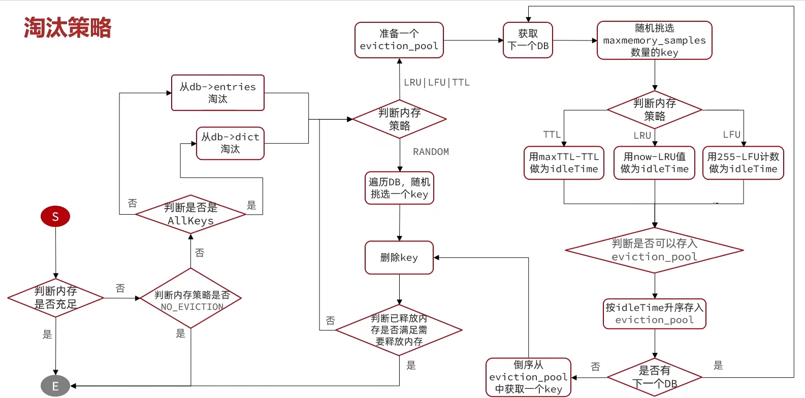

> 随机挑选maxmemory_samples数量的key通过不同的内存策略升序存入eviction_pool，淘汰值最大的key
>
> - TTL：maxTTl - TTL
> - LRU：now - LRU
> - LFU：255 - LOG_C