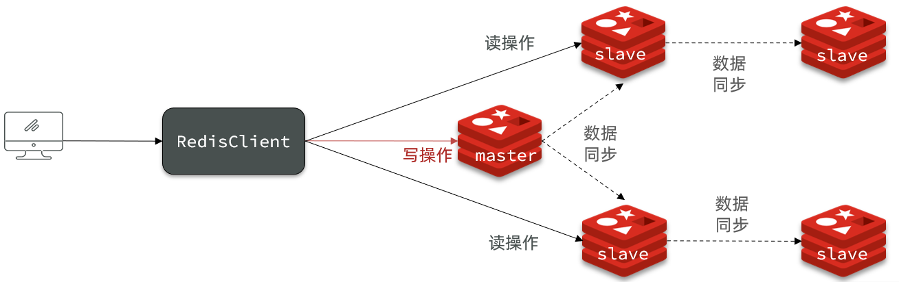
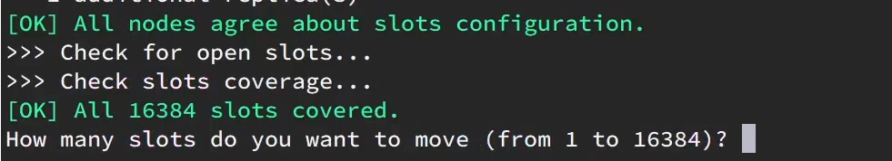

# 分布式缓存

> 笔记原件来自黑马B站视频配套笔记，经过自己加工修改添加等

-- 基于Redis集群解决单机Redis存在的问题


单机的Redis存在四大问题：


# 0.学习目标


# 1.Redis持久化

Redis有两种持久化方案：

- RDB持久化
- AOF持久化


## 1.1.RDB持久化

RDB全称Redis Database Backup file（Redis数据备份文件），也被叫做Redis数据快照。简单来说就是把内存中的所有数据都记录到磁盘中。当Redis实例故障重启后，从磁盘读取快照文件，恢复数据。快照文件称为RDB文件，默认是保存在当前运行目录。

### 1.1.1.执行时机

RDB持久化在四种情况下会执行：

1. 执行save命令
2. 执行bgsave命令
3. Redis停机时
4. 触发RDB条件时


**1）save命令**

执行下面的命令，可以立即执行一次RDB：


save命令会导致主进程执行RDB，这个过程中其它所有命令都会被阻塞。只有在数据迁移时可能用到。


**2）bgsave命令**

下面的命令可以异步执行RDB：


这个命令执行后会开启独立进程完成RDB，主进程可以持续处理用户请求，不受影响。


**3）停机时**

Redis停机时会执行一次save命令，实现RDB持久化。


**4）触发RDB条件**

Redis内部有触发RDB的机制，可以在redis.conf文件中找到，格式如下：

**redis6.0.16以下默认情况：**

```properties
# 900秒内，如果至少有1个key被修改，则执行bgsave ， 如果是save "" 则表示禁用RDB
save 900 1  
save 300 10  
save 60 10000 
```

**redis6.2和redis7.0.0默认情况：**

```properties
save 3600 1
save 300 100
save 60 10000
```


RDB的其它配置也可以在redis.conf文件中设置：

```properties
# 是否压缩 ,建议不开启，压缩也会消耗cpu，磁盘的话不值钱
rdbcompression yes

# RDB文件名称
dbfilename dump.rdb  

# 文件保存的路径目录
dir ./ 
```


### 1.1.2.RDB原理

bgsave开始时会**fork**主进程得到子进程，子进程**共享**主进程的内存数据。完成fork后读取**共享**内存数据并写入 RDB 文件**替换**旧的RDB文件。

当子进程在访问共享内存数据写RDB文件时，**主进程若要执行写操作，采用的是copy-on-write技术**：

- 当主进程执行**读操作**时，访问共享内存；
- 当主进程执行**写操作**时，将共享数据设置为read-only，**拷贝**一份数据，执行**写**操作，之后的**读**也会在副本上进行。


### 1.1.3.小结

RDB方式bgsave的基本流程？

- fork主进程得到一个子进程，共享内存空间
- 子进程读取内存数据并**异步**写入新的RDB文件
- 用新RDB文件**替换**旧的RDB文件

RDB会在什么时候执行？save 60 1000代表什么含义？

- 默认是服务停止时
- 执行save和bgsave
- 代表60秒内至少执行1000次修改则触发RDB

RDB的缺点？

- RDB执行间隔时间长，两次RDB之间写入数据有丢失的风险
- fork子进程、压缩、写出RDB文件都比较耗时


## 1.2.AOF持久化


### 1.2.1.AOF原理

AOF全称为Append Only File（追加文件）。Redis处理的每一个写命令都会记录在AOF文件，可以看做是命令日志文件。


### 1.2.2.AOF配置

AOF默认是关闭的，需要修改redis.conf配置文件来开启AOF：

```properties
# 是否开启AOF功能，默认是no
appendonly yes
# AOF文件的名称
appendfilename "appendonly.aof"
```


AOF的命令记录的频率也可以通过redis.conf文件来配：

```properties
# 表示每执行一次写命令，立即记录到AOF文件
appendfsync always 
# 写命令执行完先放入AOF缓冲区，然后表示每隔1秒将缓冲区数据写到AOF文件，是默认方案
appendfsync everysec 
# 写命令执行完先放入AOF缓冲区，由操作系统决定何时将缓冲区内容写回磁盘
appendfsync no
```


三种策略对比：


### 1.2.3.AOF文件重写

因为是记录命令，AOF文件会比RDB文件大的多。而且AOF会记录对同一个key的多次写操作，但只有最后一次写操作才有意义。通过执行bgrewriteaof命令，可以让AOF文件执行重写功能，用最少的命令达到相同效果。


如图，AOF原本有三个命令，但是`set num 123 和 set num 666`都是对num的操作，第二次会覆盖第一次的值，因此第一个命令记录下来没有意义。

所以重写命令后，AOF文件内容就是：`mset name jack num 666`


Redis也会在触发阈值时**自动去重写AOF文件**。阈值也可以在redis.conf中配置：

```properties
# AOF文件比上次文件 增长超过多少百分比则触发重写
auto-aof-rewrite-percentage 100
# AOF文件体积最小多大以上才触发重写 
auto-aof-rewrite-min-size 64mb 
```

> 满足64M的时候，满足percentage才会触发重写，文件太小重写没意义

### 1.2.4.AOF文件格式（Redis7.0以后）

aof文件保存位置：

**redis6：和RDB保存的位置相同**

**==redis7：会在RAB文件保存的位置上加上一个自己设定的appenddirname目录，保存在其中==**


文件格式：

redis6：apendfilename.aof

redis7：**aof文件被拆分为三个**


## 1.3.RDB与AOF对比

RDB和AOF各有自己的优缺点，如果对数据安全性要求较高，在实际开发中往往会**结合**两者来使用。


## 1.4 RDB和AOF混合使用


### redis数据库RDB和AOF配置，数据库备份的区别：

==**一句话：AOF的优先级高于RDB==**

**情况1：整个redis默认情况下，redis为不设置save参数且未开启了AOF持久化时，当shutdown时会生成一个有效dump文件，整个过程只能在shutdown时保存一个有效的dump文件，以至于下一次打开redis时可恢复数据**

**情况2：不设置save参数但是开启了AOF持久化时，以AOF为主，当shutdown时也会生成一个无效dump文件，备份数据库由AOF完成，若将AOF文件删除，数据库将无法完成备份**

**情况3：但是若将save 后写成空串，则是禁用所有dump文件的自动生成方式，shutdown时连空文件也不会生成，若开启了AOF，则可由AOF完成备份，若未开启AOF，则是纯缓存模式，则redis无法自动完成备份**

**情况4：设置了save参数以开启自动触发RDB，若未开启AOF，则由RDB独自完成备份，若开启了AOF且开启了混合模式，则由RDB和AOF混合完成备份，生成的AOF文件包括RDB头部和AOF混写，若未开启混合模式，则以AOF为主，AOF优先级高**


# 2.Redis主从

## 2.1.搭建主从架构

单节点Redis的并发能力是有上限的，要进一步提高Redis的并发能力，就需要搭建主从集群，实现读写分离。


具体搭建流程参考课前资料《Redis集群.md》：

 


## 2.2.主从数据同步原理


### 2.2.1.全量同步

主从第一次建立连接时，会执行**全量同步**，将master节点的所有数据都拷贝给slave节点，流程：


这里有一个问题，**master如何得知salve是第一次来连接呢**？？

有几个概念，可以作为判断依据：

- **Replication Id**：简称replid，是数据集的标记，id一致则说明是同一数据集。每一个master都有唯一的replid，slave则会继承master节点的replid
- **offset**：偏移量，随着记录在repl_baklog中的数据增多而逐渐增大。slave完成同步时也会记录当前同步的offset。如果slave的offset小于master的offset，说明slave数据落后于master，需要更新。

因此slave做数据同步，必须向master声明自己的replication id 和offset，master才可以判断到底需要同步哪些数据。


因为slave原本也是一个master，有自己的replid和offset，当第一次变成slave，与master建立连接时，发送的replid和offset是自己的replid和offset。

master判断发现**slave发送来的replid与自己的不一致**，说明这是一个全新的slave，就知道要做**全量同步**了。

master会将自己的replid和offset都发送给这个slave，slave保存这些信息。以后slave的replid就与master一致了。

因此，**master判断一个节点是否是第一次同步的依据，就是看replid是否一致**。

如图：


完整流程描述：

- slave节点请求增量同步
- **master节点判断replid**，发现不一致，拒绝增量同步
- master将完整内存数据生成RDB，发送RDB到slave
- slave清空本地数据，加载master的RDB
- master将RDB期间的命令记录在repl_baklog，并持续将log中的命令发送给slave
- slave执行接收到的命令，保持与master之间的同步


### 2.2.2.增量同步

全量同步需要先做RDB，然后将RDB文件通过网络传输个slave，成本太高了。因此除了第一次做全量同步，其它大多数时候slave与master都是做**增量同步**。

什么是增量同步？就是只更新slave与master存在差异的部分数据。如图：


那么master怎么知道slave与自己的数据差异在哪里呢?


### 2.2.3.repl_backlog原理

master怎么知道slave与自己的数据差异在哪里呢?

这就要说到全量同步时的repl_baklog文件了。

这个文件是一个固定大小的数组，只不过数组是环形，也就是说**角标到达数组末尾后，会再次从0开始读写**，这样数组头部的数据就会被覆盖。

repl_baklog中会记录Redis处理过的命令日志及offset，包括master当前的offset，和slave已经拷贝到的offset：

 

slave与master的offset之间的差异，就是salve需要增量拷贝的数据了。

随着不断有数据写入，master的offset逐渐变大，slave也不断的拷贝，追赶master的offset：

 


直到数组被填满：

 

此时，如果有新的数据写入，就会覆盖数组中的旧数据。不过，旧的数据只要是绿色的，说明是已经被同步到slave的数据，即便被覆盖了也没什么影响。因为未同步的仅仅是红色部分。


但是，如果slave出现网络阻塞，导致master的offset远远超过了slave的offset： 

 

**如果master继续写入新数据，其offset就会覆盖旧的数据**，直到将slave现在的offset也覆盖：

 


棕色框中的红色部分，就是尚未同步，但是却已经被覆盖的数据。此时如果slave恢复，需要同步，却**发现自己的offset都没有了，无法完成增量同步了**。`只能做全量同步`。


## 2.3.主从同步优化

主从同步可以保证主从数据的一致性，非常重要。

因为**全量同步非常消耗性能**，repl_baklog写满时还会发生全量同步，为了**减少或优化全量同步**：

可以从以下几个方面来**优化Redis主从集群**：

1. 在master中配置**repl-diskless-sync yes**启用**无磁盘复制**，直接将生成的rdb发送给salve，避免全量同步时的磁盘IO，提高全量同步性能。（磁盘**IO能力较差，网络强**时）
2. 设置Redis单节点上的**内存占用不要太大**，减少RDB导致的过多磁盘IO
3. 适当**提高repl_backlog_buffer的大小**，参数为repl-backlog-size（默认为1MB）发现slave宕机时尽快实现故障恢复，尽可能避免全量同步
4. 限制一个master上的slave节点数量，如果实在是太多slave，则可以采用**主-从-从链式结构，减少master压力**

主从从架构图：




## 2.4.小结

简述全量同步和增量同步区别？

- 全量同步：master将完整内存数据生成**RDB**，发送RDB到slave。后续命令则记录在repl_baklog，逐个发送给slave。
- 增量同步：slave提交自己的offset到master，master获取repl_backlog中从offset之后的命令给slave

什么时候执行全量同步？

- slave节点第一次连接master节点时
- slave节点断开时间太久，repl_baklog中的offset已经被覆盖时

什么时候执行增量同步？

- slave节点断开又恢复，并且在repl_baklog中能找到offset时


# 3.Redis哨兵

Redis提供了哨兵（Sentinel）机制来实现主从集群的自动故障恢复。

## 3.1.哨兵原理

### 3.1.1.集群结构和作用

哨兵的结构如图：


哨兵的作用如下：

- **监控**：Sentinel 会不断检查您的master和slave是否按预期工作
- **自动故障恢复**：如果master故障，Sentinel会将一个slave提升为master。当故障实例恢复后也以新的master为主
- **通知**：Sentinel充当Redis客户端的服务发现来源，当集群发生故障转移时，会将最新信息推送给Redis的客户端


### 3.1.2.集群监控原理

Sentinel基于心跳机制监测服务状态，**每隔1秒向集群的每个实例发送ping命令**：

•主观下线：如果某sentinel节点发现某实例未在规定时间响应，则认为该实例**主观下线**。

•客观下线：若**超过指定数量（quorum）的sentinel**都认为该实例主观下线，则该实例**客观下线**。quorum值最好超过**Sentinel实例数量的一半**。


### 3.1.3.集群故障恢复原理

一旦发现master故障，会在sentinel集群中**选出一个sentinel-leader**，采用**Raft算法**

- Raft算法的基本思路是**先到先得**
- 比如sentinel 1首先发现master宕机，那么他就会向sentinel 2和3发送请求成为leader，若sentinel 2和3没有接受/同意过别人的请求，就会同意sentinel 1的请求


一旦发现master故障，sentinel-leader需要在salve中**选择**一个作为**新的master**，选择依据是这样的：

- 首先会判断slave节点与master节点断开时间长短，如果超过指定值（down-after-milliseconds * 10）则会排除该slave节点
- 然后判断slave节点的**slave-priority**值，越小优先级越高，如果是0则永不参与选举
- 如果slave-prority一样，则判断slave节点的**offset值，越大说明数据越新，优先级越高**
- 最后是判断slave节点的**运行id大小**，越小优先级越高。


当选出一个新的master后，该**如何实现切换**呢？

流程如下：

- sentinel给备选的slave1节点发送**slaveof no one**命令，让该节点成为master
- sentinel给所有其它slave发送slaveof 192.168.111.100 7002 命令，让这些slave成为新master的从节点，开始从新的master上同步数据。
- 最后，sentinel**将故障节点标记为slave**，当故障节点恢复后会自动成为新的master的slave节点


### 3.1.4.Sentinel 可以防止脑裂吗？

> 如果 M1 和 R2、R3 之间的⽹络被隔离，也就是发⽣了脑裂，M1 和 R2 、 R3 隔离在了两个不同的⽹络分区中。这意味着，R2 或者 R3 其中⼀个会被选为 master，这⾥假设为 R2。
>
> 但是！这样会出现问题了！！
>
> 如果客户端 C1 是和 M1 在⼀个⽹络分区的话，从⽹络被隔离到⽹络分区恢复这段时间，C1 写⼊ M1 的数据都会丢失，并且，C1 读取的可能也是过时的数据。这是因为当⽹络分区恢复之后，M1 将会成为 slave 节点。

想要解决这个问题的话也不难，对 Redis 主从复制进⾏配置即可。

下⾯对这两个配置进⾏解释：

- **min-replicas-to-write** **1**：⽤于配置写 master ⾄少写⼊的 slave 数量，设置为 0 表示关闭该功能。3 个节点的情况下，可以配置为 1 ，表示 master 必须写⼊⾄少 1 个 slave ，否则就停⽌接受新的写⼊命令请求。
- **min-replicas-max-lag** **10** ：⽤于配置 master 多⻓时间（秒）⽆法得到从节点的响应，就认为这个节点失联。我们这⾥配置的是 10 秒，也就是说master 10 秒都得不到⼀个从节点的响应，就会认为这个从节点失联，停⽌接受新的写⼊命令请求。

不过，这样配置会降低 Redis 服务的整体可⽤性，如果 2 个 slave 都挂掉，master 将会停⽌接受新的写⼊命令请求

### 3.1.5.小结

Sentinel的三个作用是什么？

- 监控
- 故障转移
- 通知

Sentinel如何判断一个redis实例是否健康？

- 每隔1秒发送一次ping命令，如果超过一定时间没有相向则认为是主观下线
- 如果大多数sentinel都认为实例主观下线，则判定服务下线

故障转移步骤有哪些？

- 首先选定一个slave作为新的master，执行slaveof no one
- 然后让所有节点都执行slaveof 新master
- 修改故障节点配置，添加slaveof 新master


## 3.2.搭建哨兵集群

具体搭建流程参考课前资料《Redis集群.md》：

 


## 3.3.RedisTemplate

在Sentinel集群监管下的Redis主从集群，其节点会因为自动故障转移而发生变化，Redis的客户端必须感知这种变化，及时更新连接信息。Spring的RedisTemplate底层利用lettuce实现了节点的感知和自动切换。

下面，我们通过一个测试来实现RedisTemplate集成哨兵机制。

### 3.3.1.导入Demo工程

首先，我们引入课前资料提供的Demo工程：

 


### 3.3.2.引入依赖

在项目的pom文件中引入依赖：

```xml
<dependency>
    <groupId>org.springframework.boot</groupId>
    <artifactId>spring-boot-starter-data-redis</artifactId>
</dependency>
```


### 3.3.3.配置Redis地址

然后在配置文件application.yml中指定redis的sentinel相关信息：

```java
spring:
  redis:
    sentinel:
      master: mymaster
      nodes:
        - 192.168.111.100:27001
        - 192.168.111.100:27002
        - 192.168.111.100:27003
```


### 3.3.4.配置读写分离

在项目的启动类中，添加一个新的bean：

```java
@Bean
public LettuceClientConfigurationBuilderCustomizer clientConfigurationBuilderCustomizer(){
    return clientConfigurationBuilder -> clientConfigurationBuilder.readFrom(ReadFrom.REPLICA_PREFERRED);
}
```


这个bean中配置的就是读写策略，包括四种：

- MASTER：从主节点读取
- MASTER_PREFERRED：优先从master节点读取，master不可用才读取replica
- REPLICA：从slave（replica）节点读取
- REPLICA_PREFERRED：优先从slave（replica）节点读取，所有的slave都不可用才读取master


# 4.Redis分片集群


## 4.1.分片集群的特征

主从和哨兵可以解决高可用、高并发读的问题。但是依然有两个问题没有解决：

- 海量数据存储问题

- 高并发写的问题

使用分片集群可以解决上述问题，如图:


分片集群特征：

- 集群中有多个master，每个master保存不同数据

- 每个master都可以有多个slave节点

- master之间通过ping监测彼此健康状态

- 客户端请求可以访问集群任意节点，最终都会被转发到正确节点


## 4.2.搭建分片集群

具体搭建流程参考课前资料《Redis集群.md》：

 


## 4.3.散列插槽slot

### 4.3.1.插槽原理

Redis会把每一个master节点映射到0~16383共16384个插槽（hash slot）上，查看集群信息时就能看到：


数据key不是与节点绑定，而是与插槽绑定。redis会根据key的有效部分计算插槽值，分两种情况：

- key中包含"{}"，且“{}”中至少包含1个字符，“{}”中的部分是有效部分
- key中不包含“{}”，整个key都是有效部分


**为什么是16384（2^14^）个槽**，CRC16算法产生的hash值有16bit，为什么不使用2^16^=65536个槽位呢？


> **（1）65536个slot槽ping心跳包的消息头太大**


> **（2）Redis作者推荐集群1000以内节点，16384个槽够用了，因为集群节点数太多ping心跳包也会很大，消耗带宽，容易造成网络拥堵**


> **（3）在节点少的情况下，即小型集群中，因为填充率为slots/N，若采用65536的话，填充率将会很高，压缩比将会很低，不容易传输，但是采用16384的话，填充率低一些，压缩比将会高很多，容易传输些**


### 4.3.2.槽位映射算法：一致性哈希算法

> 修正：Redis Cluster使用的是哈希槽算法，在集群数量发生改变时，手动进行哈希槽的分配
> 理由:
>
> 1. 哈希槽算法更简单
> 2. 哈希槽算法可以根据机器的配置手动分配，一致性哈希不好手动分配
>
> 但是一致性哈希也有优点：比如下面所说的**缓存抖动**现象，即将数据添加到后一台机器上，而使用哈希槽会导致那部分槽位不可用

要将数据缓存在集群的哪一台节点上，采用哈希算法，这里有两种哈希算法：

1. 哈希取余算法：计算公式：hash(key) % N ，N为集群中节点的数量
   - 这种哈希算法虽然简单，但是会有一个缺点：当集群数量发生改变的时候，那么计算公式的分母发生改变，之前存储的所有slot中的数据，都要重新进行排列
2. 一致性哈希算法：计算公式：hash(key) % 2^32^
   - 目的：当服务器个数发生变动时尽量减少影响客户端到服务器的映射关系
   - 实现：采用一致性哈希环，即令 2^32^ = 0 ，让哈希表首位相连成一个环，集群中每个节点落在环上的位置是固定的
     
   - 落键规则：hash(key) 并对2^32^ 取模过后，将会落在一致性哈希环的某个位置，然后顺时针寻找第一个Redis节点，那么此key就属于该节点存储
   - 优点：若节点数量发生变化，影响的映射关系也只有出现变化的那个节点逆时针到第一个节点之间的映射关系
     例如：新增了一个节点，那么该节点逆时针到上一个节点之间的数据归新节点所有；删除了一个节点，那么该节点逆时针到上一个节点之间的数据归顺时针下一个节点所有
   - 缺点：当节点太少时，容易发生数据倾斜问题


### 4.3.3.客户端操作

**连接客户端集群模式：**

```
redis-cli -p 7001 -c
```

我的：

```
redis-cli -a 123456 -p 6381 -c
```

- -c：集群模式，若不加-c，根据key映射的slot不在此节点时将会报错


例如：key是num，那么就根据num计算，如果是{itcast}num，则根据itcast计算。计算方式是利用CRC16算法得到一个hash值，然后对16384取余，得到的结果就是slot值。

 

如图，在7001这个节点执行set a 1时，对a做hash运算，对16384取余，得到的结果是15495，因此要存储到103节点。

到了7003后，执行`get num`时，对num做hash运算，对16384取余，得到的结果是2765，因此需要切换到7001节点


如何将同一类数据固定的**保存在同一个Redis实例**？

- 这一类数据使用相同的有效部分，例如key都以**{typeId}为前缀**


**查看集群节点信息：**

```
127.0.0.1:7001> cluster nodes
```

```
redis-cli -a 123456 -p 7001 cluster nodes
```


**查看某个key对应的slot：**

```
cluster keyslot key
```


**查看slot是否被使用：**

```
cluster countkeysinslot 槽位数字编号
```

- 返回0：没被使用
- 返回1：已被使用


### 4.3.4.小结

Redis如何判断某个key应该在哪个实例？

- 将16384个插槽分配到不同的实例
- 根据key的有效部分计算哈希值，对16384取余
- 余数作为插槽，寻找插槽所在实例即可

如何将同一类数据固定的保存在同一个Redis实例？

- 这一类数据使用相同的有效部分，例如key都以{typeId}为前缀


## 4.4.集群伸缩

redis-cli --cluster提供了很多操作集群的命令，可以通过下面方式查看：


比如，添加节点的命令：


### 4.4.1.需求分析

需求：向集群中添加一个新的master节点，并向其中存储 num = 10

- 启动一个新的redis实例，端口为7004
- 添加7004到之前的集群，并作为一个master节点
- 给7004节点分配插槽，使得num这个key可以存储到7004实例


这里需要两个新的功能：

- 添加一个节点到集群中
- 将部分插槽分配到新插槽


### 4.4.2.创建新的redis实例

创建一个文件夹：

```sh
mkdir 7004
```

拷贝配置文件：

```sh
cp redis.conf /7004
```

修改配置文件：

```sh
sed /s/6379/7004/g 7004/redis.conf
```

启动

```sh
redis-server 7004/redis.conf
```


### 4.4.3.添加新节点到redis

我的：
**集群扩容全部命令总结：**

```
redis-server /myredis/cluster/redisCluster6387.conf		#启动6387server
redis-server /myredis/cluster/redisCluster6388.conf		#启动6388server
redis-cli -a 111111 --cluster add-node 192.168.111.100:6387 192.168.111.100:6381	#将6387作为新的master加入集群，6381为引荐人
redis-cli -a 111111 --cluster check 192.168.111.100:6381	#第一次检查
redis-cli -a 111111 --cluster reshard 192.168.111.100:6381		#给6387分配slot
redis-cli -a 111111 --cluster check 192.168.111.100:6381		#第二次检查
redis-cli -a 111111 --cluster add-node 192.168.111.100:6388 192.168.111.100:6387 --cluster-slave --cluster-master-id xxxxxxxxxxxxxxxxxxxxx(6387id)		#让6388成为6387的从节点
redis-cli -a 111111 --cluster check 192.168.111.100:6381		#第三c
```


添加节点的语法如下：


执行命令：

```sh
redis-cli --cluster add-node 192.168.111.100:7004 192.168.111.100:7001
```


通过命令查看集群状态：

```sh
redis-cli -p 7001 cluster nodes
```

我的：也可以使用check命令：

```
redis-cli -a 111111 --cluster check 192.168.111.100:6381
```


如图，7004加入了集群，并且默认是一个master节点：


但是，可以看到7004节点的插槽数量为0，因此没有任何数据可以存储到7004上


### 4.4.4.转移插槽

我们要将num存储到7004节点，因此需要先看看num的插槽是多少：


如上图所示，num的插槽为2765.


我们可以将0~3000的插槽从7001转移到7004，命令格式如下：


具体命令如下：

建立连接：


得到下面的反馈：




询问要移动多少个插槽，我们计划是3000个：

新的问题来了：


那个node来接收这些插槽？？

显然是7004，那么7004节点的id是多少呢？


复制这个id，然后拷贝到刚才的控制台后：


这里询问，你的插槽是从哪里移动过来的？

- all：代表全部，也就是三个节点各转移一部分
- 具体的id：目标节点的id
- done：没有了


这里我们要从7001获取，因此填写7001的id：


填完后，点击done，这样插槽转移就准备好了：


确认要转移吗？输入yes：

然后，通过命令查看结果：

 

可以看到： 


目的达成。


### 4.4.5.集群缩容

我的：
**集群缩容全部命令总结：**

```shell
redis-cli -a 111111 --cluster check 192.168.111.100:6388	#获得6388的ID
redis-cli -a 111111 --cluster del-node 192.168.111.100:6388 xxxxxxxx(6388id)  #删除6388
redis-cli -a 111111 --cluster reshard 192.168.111.100:6381    #把6387的slot都给6381
redis-cli -a 111111 --cluster check 192.168.111.100:6381    #第二次检查
redis-cli -a 111111 --cluster del-node 192.168.111.100:6387 xxxxxxxx(6387id)  #删除6387
redis-cli -a 111111 --cluster check 192.168.111.100:6381	#第三次检查
```


## 4.5.故障转移

集群初识状态是这样的：


其中7001、7002、7003都是master，我们计划让7002宕机。


### 4.5.1.自动故障转移

当集群中有一个master宕机会发生什么呢？

直接停止一个redis实例，例如7002：

```sh
redis-cli -p 7002 shutdown
```


1）首先是该实例与其它实例失去连接

2）然后是疑似宕机：


3）最后是确定下线，自动提升一个slave为新的master：


4）当7002再次启动，就会变为一个slave节点了：


### 4.5.2.手动故障转移

利用cluster failover命令可以手动让集群中的某个master宕机，切换到执行cluster failover命令的这个slave节点，实现无感知的数据迁移。其流程如下：


这种failover命令可以指定三种模式：

- 缺省：默认的流程，如图1~6歩
- force：省略了对offset的一致性校验
- takeover：直接执行第5歩，忽略数据一致性、忽略master状态和其它master的意见


**案例需求**：在7002这个slave节点执行手动故障转移，重新夺回master地位

步骤如下：

1）利用redis-cli连接7002这个节点

2）执行**cluster failover**命令

如图：


效果：


### 4.5.3 Redis动态扩/缩容时，若有请求过来怎么办？

Redis动态扩/缩容时，slot槽位会发生变化，若是请求经过hash到达对应的节点后，发现slot槽已经迁移支别的节点上了，该怎么办？

- 1.当客户端向集群中某个节点发送命令，节点向客户端返回moved异常，告诉客户端数据对应目标槽的节点信息。
- 2.客户端再向目标节点发送命令，目标节点中的槽已经迁移出别的节点上了，此时目标节点会返回ask重定向给客户端。
- 2.客户端向新的target节点发送Asking命令，然后再次向新节点发送请求请求命令。
- 3.新节点target执行命令，把命令执行结果返回给客户端。

> moved和ask重定向的区别：
> 两者都是客户端重定向
> moved异常：槽已经确定迁移，即槽已经不在当前节点
> ask异常：槽还在迁移中

> 集群节点较多时，客服端大多数请求都会发生重定向，每次重定向都会产生一次无用的请求，严重影响了redis的性能。
>
> smart智能客户端知道由哪个节点负责管理哪个槽，而且某个当节点与槽的映射关系发生改变时，客户端也会进行响应的更新，这是一种非常高效的请求方式。例如Jedis就设置了JedisCluster类作为smart客户端，将映射关系保存在本地，当出现重定向时更新本地的映射关系，连续出现5次未找到目标节点，则抛出异常：Too many cluster redirection

### 4.5 RedisCluster的故障选举

集群节点创建时，不管是 master还是slave，都置**currentEpoch为0**。 当前节点在接受其他节点发送的请求时，如果发送者的currentEpoch（消息头部会包含发送者的 currentEpoch）大于当前节点的currentEpoch，那么当前节点会更新currentEpoch。 因此，集群中所有节点的 currentEpoch最终会达成一致，相当于对集群状态的认知达成了一致。

**master节点选举过程：**

- 1.slave发现自己的master变为FAIL。
- 2.发起选举前，slave先给自己的epoch（即currentEpoch）加一，然后请求集群中其它master给自己投票，并广播信息给集群中其他节点。
- 3.slave发起投票后，会等待至少两倍NODE_TIMEOUT时长接收投票结果，不管NODE_TIMEOUT何值，也至少会等待2秒。
- 4.其他节点收到该信息，只有master响应，判断请求者的合法性，并发送结果。
- 5.尝试选举的slave收集master返回的结果，收到超过半投票数master的统一后变成新Master，如果失败会发起第二次选举，选举轮次标记+1继续上面的流程。
- 6.选举成功后，广播Pong消息通知集群其它节点。

之所以强制延迟至少0.5秒选举，是为确保master的fail状态在整个集群内传开，否则可能只有小部分master知晓，而master只会给处于fail状态的master的slaves投票。 如果一个slave的master状态不是fail，则其它master不会给它投票，Redis通过八卦协议（即Gossip协议，也叫谣言协议）传播fail。 

而在固定延迟上再加一个随机延迟，是为了避免多个slaves同时发起选举。

## 4.6.RedisTemplate访问分片集群

RedisTemplate底层同样基于lettuce实现了分片集群的支持，而使用的步骤与哨兵模式基本一致：

1）引入redis的starter依赖

2）配置分片集群地址

3）配置读写分离

与哨兵模式相比，1）和3）已在哨兵模式下配置过了，其中只有分片集群的配置方式略有差异，如下：

```yaml
spring:
  redis:
    cluster:
      nodes:
        - 192.168.111.100:7001
        - 192.168.111.100:7002
        - 192.168.111.100:7003
        - 192.168.111.100:8001
        - 192.168.111.100:8002
        - 192.168.111.100:8003
```


